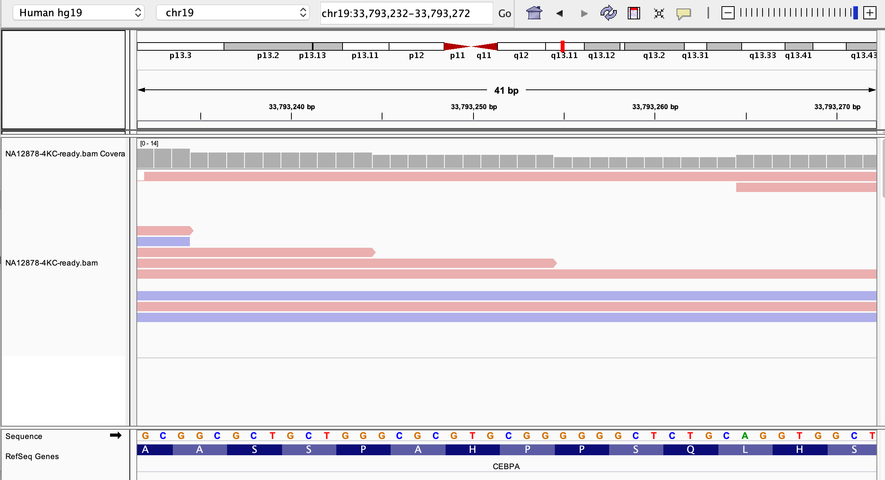
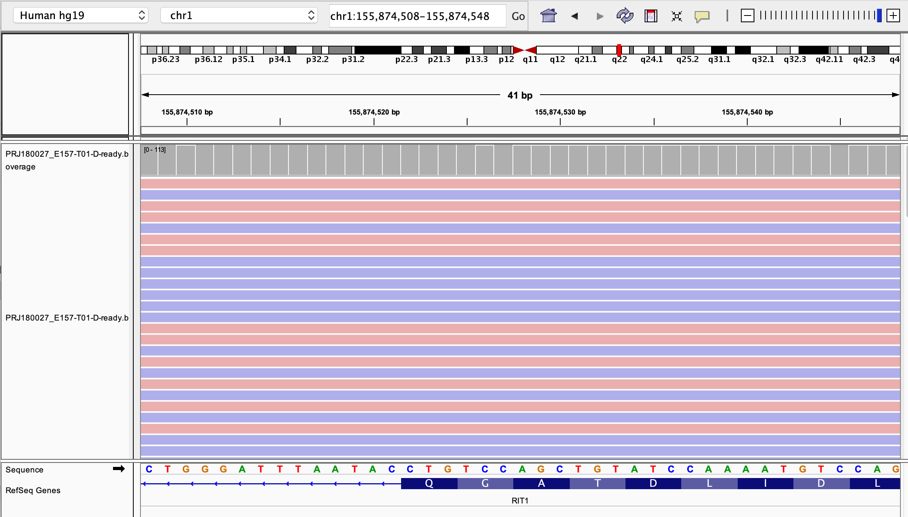

# Contents

<!-- vim-markdown-toc GFM -->

* [Introduction](#introduction)
* [Cacao overview](#cacao-overview)
    * [Useful parameters](#useful-parameters)
* [Aim of the analysis](#aim-of-the-analysis)
* [Input samples](#input-samples)
* [Results](#results)
    * [Germline sample](#germline-sample)
    * [Somatic sample](#somatic-sample)
* [Conclusion](#conclusion)

<!-- vim-markdown-toc -->

# Introduction

This report documents work done as part of profiling CAllable CAncer LOci framework [Cacao](https://github.com/sigven/cacao), for analysis of sequencing coverage across various actionable/pathogenic loci.

## Cacao overview

Cacao reports sequecing depth across three clinically relevant loci

1. Pathogenic loci (Hereditary/Germline cancer) using ClinVar as a reference.
2. Actionable somatic loci (Sporadic cancer) using CIViC as a reference.
3. Somatic cancer hotspots using cancerhotspots as a reference.

**Useful parameters**

- Mode (somatic OR germline)
- `mapq` (alignment quality threshold)
- `query_target` (tager regions filename)
- `callability_levels` (colon-separated string that defines four levels of variant callability: `NO_COVERAGE`, `LOW_COVERAGE`, `CALLABLE`, `HIGH_COVERAGE`. Initial value must be 0. (default: 0:10:100)


## Aim of the analysis

Running on a germline sample with the callability cutoff `0:13:500` and only run cacao in germline mode for these.

	0 - NO_COVERAGE
	13 - LOW_COVERAGE
	500 - CALLABLE
	>500 - HIGH_COVERAGE

Running on a tumour sample by adjusting the `LOW_COVERAGE` cutoff by cellularity i.e. a tumour sample with 50% cellularity should have a cutoff of `0:26:500`

	0 - NO_COVERAGE
	26 - LOW_COVERAGE
	500 - CALLABLE
	>500 - HIGH_COVERAGE
	
Analyse the report of both runs and validate results in IGV.
 
 - I am planning to look at a few `CALLABLE or HIGH_COVERAGE` and `LOW_COVERAGE` regions in IGV to confirm it's working as intended.

## Input samples

- GIAB germline sample `/data/cephfs/punim0010/data/Results_Local/Accreditation/GiaB/2017-11-13/WGS-GiaB-merged/final/NA12878-4KC/NA12878-4KC-ready.bam`

- A5 tumour sample `/data/cephfs/punim0010/data/Results/Tothill-A5/2018-05-05/final/PRJ180027_E157-T01-D/PRJ180027_E157-T01-D-ready.bam`

- Also used Arthurs target [cancer gene list](https://trello.com/c/7j3KFMiL)

## Results

### Germline Sample

**Run command**

```
python3 cacao_wflow.py --query_target ../../data/beds/cancer_
genes.20181112.genes.bed --mapq 20 --callability_levels_germline 0:13:500 ../../data/bams/NA12878-4KC-ready.bam ./data/ ../../Misc/cacao/NA12878-4KC/callability_change/ grch37 hereditary NA12878-4KC
```

**Profile**

| Input_size      | Runtime | Callability | Mapping_quality |
|-----------------|---------|-------------|-----------------|
| 73G             | 30mins  | 0:13:500    | 20              |

**HIGH_COVERAGE Regions**

No loci found.

**CALLABLE Regions**


| Gene      | Genomic change | Coverage | IGV Agreement|
|-----------|----------------|----------|--------------|
| PRSS1      | `7_142458430_A_G` | 132 | No           |
| PRSS1      | `7_142458451_A_C, 7_142458451_A_T` | 124 | Yes (A_T)|
| TERT      | `5_1294663_T_TC` | 114 | No|


**LOW_COVERAGE Regions**

| Gene      | Genomic change | Coverage | IGV Agreement|
|-----------|----------------|----------|--------------|
| CEBPA      | `19_33793252_C_CG` | 5 | No           |



### Somatic sample

**Run command**

```
python3 cacao_wflow.py --query_target ../../data/beds/cancer_
genes.20181112.genes.bed --mapq 20 --callability_levels_somatic 0:26:500 ../../data/bams/PRJ180027_E157-T01-D-ready.bam ./data/ ../../Misc/cacao/PRJ180027_E157_tageted/PRJ180027_E157_callability/ grch37 somatic PRJ180027_E157
```

**Profile**

| Input_size      | Runtime | Callability | Mapping_quality |
|-----------------|---------|-------------|-----------------|
| 100G            | 40mins  | 0:26:500    | 20              |

#### Track 1 - Actionable Somatic Loci:

**HIGH_COVERAGE Regions**

No loci found.

**CALLABLE Regions**


| Gene      | Genomic change | Coverage | IGV Agreement|
|-----------|----------------|----------|--------------|
| AKT3      | `1_243859016_C_T` | 138 | No           |
| DDR2      | `1_162748390_T_A` | 123 | No           |


**LOW_COVERAGE Regions**

No loci found.

#### Track-2 Somatic cancer hotspots

**HIGH_COVERAGE Regions**

No loci found.

**CALLABLE Regions**

| Gene      | Genomic change | Coverage | IGV Agreement|
|-----------|----------------|----------|--------------|
| H3F3A      | `1_226252134_AA_CG ` | 108 | No         |
| RIT1      | `1_155874528_AGC_CGA` | 106 | No         |




**LOW_COVERAGE Regions**

| Gene      | Genomic change | Coverage | IGV Agreement|
|-----------|----------------|----------|--------------|
| IRS2      | `13_110435230_GC_AT` | 14 | No         |


## Conclusion

- Coverage assessment :smiley:
- Genomic changes :worried:

From this analysis it seems Cacao is _not_ identifying coverage for genomic changes in the sample bam but the coverage of genomic changes in the reference data, not taking into account if the change occurs in the sample bam or not.

This `Most importantly, the software will pinpoint genomic loci of clinical relevance in cancer that has sufficient sequencing coverage for reliable variant calling` from cacao's README probably is referring to above conclusion?


