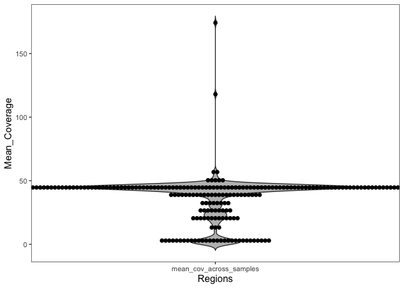

```r
### Required packages.
library(here)
library(dplyr)
library(tidyverse)
library(stringr)
library(DT)
library(jtools)
```

***

## Introduction

GRCh38/hg38 is the assembly of the human genome released December of 2013, that uses alternate or ALT contigs to represent common complex variation, including ALT contigs to represent common complex variation, including HLA loci. Alternate contigs, alternate scaffolds or alternate loci allow for representation of diverging haplotypes. These regions are too complex for a single representation. Identify ALT contigs by their _alt suffix. The GRCh38 ALT contigs total 109Mb in length and span 60Mb of the primary assembly. Alternate contig sequences can be novel to highly diverged or nearly identical to corresponding primary assembly sequence. Sequences that are highly diverged from the primary assembly only contribute a few million bases. Most subsequences of ALT contigs are fairly similar to the primary assembly (reference: https://gatk.broadinstitute.org/hc/en-us/articles/360041155232-Reference-Genome-Components). In this analysis, we are interested in looking at the coverage of ALT regions on chromosome in our WGS normal samples. 

## Data

The WGS alignment files for normal samples used in calculating coverage exist in GDS. The location of this data is:

```
gds://production/analysis_data/SBJ02788/wgs_tumor_normal/2022090499823d77/L2201304_L2201302_dragen/MDX220237_normal.bam
gds://production/analysis_data/SBJ02805/wgs_tumor_normal/20220904aa166c4d/L2201307_L2201306_dragen/PRJ222041_normal.bam
gds://production/analysis_data/SBJ02806/wgs_tumor_normal/202209040a250353/L2201317_L2201308_dragen/PRJ222047_normal.bam
gds://production/analysis_data/SBJ02809/wgs_tumor_normal/20220917d5f9d1f7/L2201370_L2201369_dragen/PRJ222092_normal.bam
gds://production/analysis_data/SBJ02811/wgs_tumor_normal/202209111885fd6f/L2201333_L2201332_dragen/MDX220248_normal.bam
gds://production/analysis_data/SBJ02827/wgs_tumor_normal/202209175a7a450c/L2201366_L2201365_dragen/PRJ222068_normal.bam
gds://production/analysis_data/SBJ02829/wgs_tumor_normal/202209172b49283c/L2201364_L2201363_dragen/MDX220256_normal.bam
gds://production/analysis_data/SBJ02830/wgs_tumor_normal/2022091751eec22b/L2201374_L2201373_dragen/PRJ222096_normal.bam
gds://production/analysis_data/SBJ02831/wgs_tumor_normal/20220917fb72fcff/L2201372_L2201371_dragen/PRJ222093_normal.bam
gds://production/analysis_data/SBJ02739/wgs_tumor_normal/20220821c421d212/L2201209_L2201210_dragen/PRJ222014_normal.bam
```


mosdepth was used to calculate mean per-region given a [BED file](./Alt_contigs_hg38_sorted.bed) of regions. The result is summarized below.


```r
# read in bed file with regions of interest
bed_coverage <- as.data.frame(read.table("/Users/kanwals/UMCCR/git/sk-explore/coverage_alts/Alt_contigs_hg38_sorted.bed", header = FALSE, sep="\t", stringsAsFactors=FALSE))
colnames(bed_coverage) <- c("chr", "region_start", "region_end")

# list files in the input directory - made using mosdepth
list_of_files <- list.files(path = params$mosdepth_output,
                            recursive = TRUE,
                            pattern = "\\.bed.gz$",
                            full.names = TRUE)

for (i in 1:length(list_of_files)){
  # read files and prepare data format for display
  file <- read_tsv(list_of_files[i],col_names = c("chr", "region_start", "region_end", "mean_coverage" ),col_types = "cn") %>%
      mutate(sample_id = basename(list_of_files[i])) %>%
      mutate(sample_id = gsub("*_normal.regions.bed.gz", "", sample_id)) 
  # find sample id and rename mean_coverage column using it
  sample_name <- unique(file$sample_id)
  sample_coverage <- file %>%
    dplyr::rename(!!sample_name := mean_coverage) %>%
    dplyr::select(one_of(sample_name))
  # add sample_coverage to original bed file
  bed_coverage <- cbind(bed_coverage, sample_coverage)
}

mean_cov_across_samples = round(rowMeans(bed_coverage[,c(5:ncol(bed_coverage))]), 2)
bed_coverage <- add_column(bed_coverage, mean_cov_across_samples, .after = 3)
```

## Plot results

We are interested to check what regions consistently have less than X coverage (say less than 500x in 90% of the samples). On the basis of this information, we might consider dropping them from the assay. 


```r
# plot results - violin plot
bed_coverage %>%
  dplyr::select(mean_cov_across_samples) %>%
  gather(key="Samples", value="Mean_Coverage") %>%
  ggplot( aes(x=Samples, y=Mean_Coverage)) +
  geom_violin(trim=FALSE, fill="grey") + 
  geom_dotplot(binaxis= "y",
               stackdir = "center",
               dotsize = 0.5,
               fill = 1) +
  theme_apa()
```

<!-- -->


```r
# display filtered data in a table
datatable(bed_coverage, rownames = FALSE, filter="top", options = list(pageLength = 10, scrollX=T, scrollY=T), caption = "Regions consistently with low coverage <500")
```

```{=html}
<div id="htmlwidget-503be4f871d00aad65bc" style="width:100%;height:auto;" class="datatables html-widget"></div>
<script type="application/json" data-for="htmlwidget-503be4f871d00aad65bc">{"x":{"filter":"top","vertical":false,"filterHTML":"<tr>\n  <td data-type=\"character\" style=\"vertical-align: top;\">\n    <div class=\"form-group has-feedback\" style=\"margin-bottom: auto;\">\n      <input type=\"search\" placeholder=\"All\" class=\"form-control\" style=\"width: 100%;\"/>\n      <span class=\"glyphicon glyphicon-remove-circle form-control-feedback\"><\/span>\n    <\/div>\n  <\/td>\n  <td data-type=\"integer\" style=\"vertical-align: top;\">\n    <div class=\"form-group has-feedback\" style=\"margin-bottom: auto;\">\n      <input type=\"search\" placeholder=\"All\" class=\"form-control\" style=\"width: 100%;\" disabled=\"\"/>\n      <span class=\"glyphicon glyphicon-remove-circle form-control-feedback\"><\/span>\n    <\/div>\n    <div style=\"display: none;position: absolute;width: 200px;opacity: 1\">\n      <div data-min=\"0\" data-max=\"1\"><\/div>\n      <span style=\"float: left;\"><\/span>\n      <span style=\"float: right;\"><\/span>\n    <\/div>\n  <\/td>\n  <td data-type=\"integer\" style=\"vertical-align: top;\">\n    <div class=\"form-group has-feedback\" style=\"margin-bottom: auto;\">\n      <input type=\"search\" placeholder=\"All\" class=\"form-control\" style=\"width: 100%;\"/>\n      <span class=\"glyphicon glyphicon-remove-circle form-control-feedback\"><\/span>\n    <\/div>\n    <div style=\"display: none;position: absolute;width: 200px;opacity: 1\">\n      <div data-min=\"36640\" data-max=\"5161414\"><\/div>\n      <span style=\"float: left;\"><\/span>\n      <span style=\"float: right;\"><\/span>\n    <\/div>\n  <\/td>\n  <td data-type=\"number\" style=\"vertical-align: top;\">\n    <div class=\"form-group has-feedback\" style=\"margin-bottom: auto;\">\n      <input type=\"search\" placeholder=\"All\" class=\"form-control\" style=\"width: 100%;\"/>\n      <span class=\"glyphicon glyphicon-remove-circle form-control-feedback\"><\/span>\n    <\/div>\n    <div style=\"display: none;position: absolute;width: 200px;opacity: 1\">\n      <div data-min=\"0.48\" data-max=\"174.24\" data-scale=\"2\"><\/div>\n      <span style=\"float: left;\"><\/span>\n      <span style=\"float: right;\"><\/span>\n    <\/div>\n  <\/td>\n  <td data-type=\"number\" style=\"vertical-align: top;\">\n    <div class=\"form-group has-feedback\" style=\"margin-bottom: auto;\">\n      <input type=\"search\" placeholder=\"All\" class=\"form-control\" style=\"width: 100%;\"/>\n      <span class=\"glyphicon glyphicon-remove-circle form-control-feedback\"><\/span>\n    <\/div>\n    <div style=\"display: none;position: absolute;width: 200px;opacity: 1\">\n      <div data-min=\"0.13\" data-max=\"218.48\" data-scale=\"2\"><\/div>\n      <span style=\"float: left;\"><\/span>\n      <span style=\"float: right;\"><\/span>\n    <\/div>\n  <\/td>\n  <td data-type=\"number\" style=\"vertical-align: top;\">\n    <div class=\"form-group has-feedback\" style=\"margin-bottom: auto;\">\n      <input type=\"search\" placeholder=\"All\" class=\"form-control\" style=\"width: 100%;\"/>\n      <span class=\"glyphicon glyphicon-remove-circle form-control-feedback\"><\/span>\n    <\/div>\n    <div style=\"display: none;position: absolute;width: 200px;opacity: 1\">\n      <div data-min=\"0.17\" data-max=\"194.19\" data-scale=\"2\"><\/div>\n      <span style=\"float: left;\"><\/span>\n      <span style=\"float: right;\"><\/span>\n    <\/div>\n  <\/td>\n  <td data-type=\"number\" style=\"vertical-align: top;\">\n    <div class=\"form-group has-feedback\" style=\"margin-bottom: auto;\">\n      <input type=\"search\" placeholder=\"All\" class=\"form-control\" style=\"width: 100%;\"/>\n      <span class=\"glyphicon glyphicon-remove-circle form-control-feedback\"><\/span>\n    <\/div>\n    <div style=\"display: none;position: absolute;width: 200px;opacity: 1\">\n      <div data-min=\"0.5\" data-max=\"206.48\" data-scale=\"2\"><\/div>\n      <span style=\"float: left;\"><\/span>\n      <span style=\"float: right;\"><\/span>\n    <\/div>\n  <\/td>\n  <td data-type=\"number\" style=\"vertical-align: top;\">\n    <div class=\"form-group has-feedback\" style=\"margin-bottom: auto;\">\n      <input type=\"search\" placeholder=\"All\" class=\"form-control\" style=\"width: 100%;\"/>\n      <span class=\"glyphicon glyphicon-remove-circle form-control-feedback\"><\/span>\n    <\/div>\n    <div style=\"display: none;position: absolute;width: 200px;opacity: 1\">\n      <div data-min=\"0.03\" data-max=\"141.28\" data-scale=\"2\"><\/div>\n      <span style=\"float: left;\"><\/span>\n      <span style=\"float: right;\"><\/span>\n    <\/div>\n  <\/td>\n  <td data-type=\"number\" style=\"vertical-align: top;\">\n    <div class=\"form-group has-feedback\" style=\"margin-bottom: auto;\">\n      <input type=\"search\" placeholder=\"All\" class=\"form-control\" style=\"width: 100%;\"/>\n      <span class=\"glyphicon glyphicon-remove-circle form-control-feedback\"><\/span>\n    <\/div>\n    <div style=\"display: none;position: absolute;width: 200px;opacity: 1\">\n      <div data-min=\"0.33\" data-max=\"121.49\" data-scale=\"2\"><\/div>\n      <span style=\"float: left;\"><\/span>\n      <span style=\"float: right;\"><\/span>\n    <\/div>\n  <\/td>\n  <td data-type=\"number\" style=\"vertical-align: top;\">\n    <div class=\"form-group has-feedback\" style=\"margin-bottom: auto;\">\n      <input type=\"search\" placeholder=\"All\" class=\"form-control\" style=\"width: 100%;\"/>\n      <span class=\"glyphicon glyphicon-remove-circle form-control-feedback\"><\/span>\n    <\/div>\n    <div style=\"display: none;position: absolute;width: 200px;opacity: 1\">\n      <div data-min=\"0.52\" data-max=\"175.81\" data-scale=\"2\"><\/div>\n      <span style=\"float: left;\"><\/span>\n      <span style=\"float: right;\"><\/span>\n    <\/div>\n  <\/td>\n  <td data-type=\"number\" style=\"vertical-align: top;\">\n    <div class=\"form-group has-feedback\" style=\"margin-bottom: auto;\">\n      <input type=\"search\" placeholder=\"All\" class=\"form-control\" style=\"width: 100%;\"/>\n      <span class=\"glyphicon glyphicon-remove-circle form-control-feedback\"><\/span>\n    <\/div>\n    <div style=\"display: none;position: absolute;width: 200px;opacity: 1\">\n      <div data-min=\"0.32\" data-max=\"118.14\" data-scale=\"2\"><\/div>\n      <span style=\"float: left;\"><\/span>\n      <span style=\"float: right;\"><\/span>\n    <\/div>\n  <\/td>\n  <td data-type=\"number\" style=\"vertical-align: top;\">\n    <div class=\"form-group has-feedback\" style=\"margin-bottom: auto;\">\n      <input type=\"search\" placeholder=\"All\" class=\"form-control\" style=\"width: 100%;\"/>\n      <span class=\"glyphicon glyphicon-remove-circle form-control-feedback\"><\/span>\n    <\/div>\n    <div style=\"display: none;position: absolute;width: 200px;opacity: 1\">\n      <div data-min=\"0.17\" data-max=\"191.52\" data-scale=\"2\"><\/div>\n      <span style=\"float: left;\"><\/span>\n      <span style=\"float: right;\"><\/span>\n    <\/div>\n  <\/td>\n  <td data-type=\"number\" style=\"vertical-align: top;\">\n    <div class=\"form-group has-feedback\" style=\"margin-bottom: auto;\">\n      <input type=\"search\" placeholder=\"All\" class=\"form-control\" style=\"width: 100%;\"/>\n      <span class=\"glyphicon glyphicon-remove-circle form-control-feedback\"><\/span>\n    <\/div>\n    <div style=\"display: none;position: absolute;width: 200px;opacity: 1\">\n      <div data-min=\"0.26\" data-max=\"191.2\" data-scale=\"2\"><\/div>\n      <span style=\"float: left;\"><\/span>\n      <span style=\"float: right;\"><\/span>\n    <\/div>\n  <\/td>\n  <td data-type=\"number\" style=\"vertical-align: top;\">\n    <div class=\"form-group has-feedback\" style=\"margin-bottom: auto;\">\n      <input type=\"search\" placeholder=\"All\" class=\"form-control\" style=\"width: 100%;\"/>\n      <span class=\"glyphicon glyphicon-remove-circle form-control-feedback\"><\/span>\n    <\/div>\n    <div style=\"display: none;position: absolute;width: 200px;opacity: 1\">\n      <div data-min=\"0.84\" data-max=\"228.04\" data-scale=\"2\"><\/div>\n      <span style=\"float: left;\"><\/span>\n      <span style=\"float: right;\"><\/span>\n    <\/div>\n  <\/td>\n<\/tr>","caption":"<caption>Regions consistently with low coverage &lt;500<\/caption>","data":[["chr1_GL383518v1_alt","chr1_GL383519v1_alt","chr1_GL383520v2_alt","chr1_KI270759v1_alt","chr1_KI270760v1_alt","chr1_KI270761v1_alt","chr1_KI270762v1_alt","chr1_KI270763v1_alt","chr1_KI270764v1_alt","chr1_KI270765v1_alt","chr1_KI270766v1_alt","chr1_KI270892v1_alt","chr2_GL383521v1_alt","chr2_GL383522v1_alt","chr2_GL582966v2_alt","chr2_KI270767v1_alt","chr2_KI270768v1_alt","chr2_KI270769v1_alt","chr2_KI270770v1_alt","chr2_KI270771v1_alt","chr2_KI270772v1_alt","chr2_KI270773v1_alt","chr2_KI270774v1_alt","chr2_KI270775v1_alt","chr2_KI270776v1_alt","chr2_KI270893v1_alt","chr2_KI270894v1_alt","chr3_GL383526v1_alt","chr3_JH636055v2_alt","chr3_KI270777v1_alt","chr3_KI270778v1_alt","chr3_KI270779v1_alt","chr3_KI270780v1_alt","chr3_KI270781v1_alt","chr3_KI270782v1_alt","chr3_KI270783v1_alt","chr3_KI270784v1_alt","chr3_KI270895v1_alt","chr3_KI270924v1_alt","chr3_KI270934v1_alt","chr3_KI270935v1_alt","chr3_KI270936v1_alt","chr3_KI270937v1_alt","chr4_GL000257v2_alt","chr4_GL383527v1_alt","chr4_GL383528v1_alt","chr4_KI270785v1_alt","chr4_KI270786v1_alt","chr4_KI270787v1_alt","chr4_KI270788v1_alt","chr4_KI270789v1_alt","chr4_KI270790v1_alt","chr4_KI270896v1_alt","chr4_KI270925v1_alt","chr5_GL339449v2_alt","chr5_GL383530v1_alt","chr5_GL383531v1_alt","chr5_GL383532v1_alt","chr5_GL949742v1_alt","chr5_KI270791v1_alt","chr5_KI270792v1_alt","chr5_KI270793v1_alt","chr5_KI270794v1_alt","chr5_KI270795v1_alt","chr5_KI270796v1_alt","chr5_KI270897v1_alt","chr5_KI270898v1_alt","chr6_GL000250v2_alt","chr6_GL000251v2_alt","chr6_GL000252v2_alt","chr6_GL000253v2_alt","chr6_GL000254v2_alt","chr6_GL000255v2_alt","chr6_GL000256v2_alt","chr6_GL383533v1_alt","chr6_KB021644v2_alt","chr6_KI270758v1_alt","chr6_KI270797v1_alt","chr6_KI270798v1_alt","chr6_KI270799v1_alt","chr6_KI270800v1_alt","chr6_KI270801v1_alt","chr6_KI270802v1_alt","chr7_GL383534v2_alt","chr7_KI270803v1_alt","chr7_KI270804v1_alt","chr7_KI270805v1_alt","chr7_KI270806v1_alt","chr7_KI270807v1_alt","chr7_KI270808v1_alt","chr7_KI270809v1_alt","chr7_KI270899v1_alt","chr8_KI270810v1_alt","chr8_KI270811v1_alt","chr8_KI270812v1_alt","chr8_KI270813v1_alt","chr8_KI270814v1_alt","chr8_KI270815v1_alt","chr8_KI270816v1_alt","chr8_KI270817v1_alt","chr8_KI270818v1_alt","chr8_KI270819v1_alt","chr8_KI270820v1_alt","chr8_KI270821v1_alt","chr8_KI270822v1_alt","chr8_KI270900v1_alt","chr8_KI270901v1_alt","chr8_KI270926v1_alt","chr9_GL383539v1_alt","chr9_GL383540v1_alt","chr9_GL383541v1_alt","chr9_GL383542v1_alt","chr9_KI270823v1_alt","chr10_GL383545v1_alt","chr10_GL383546v1_alt","chr10_KI270824v1_alt","chr10_KI270825v1_alt","chr11_GL383547v1_alt","chr11_JH159136v1_alt","chr11_JH159137v1_alt","chr11_KI270826v1_alt","chr11_KI270827v1_alt","chr11_KI270829v1_alt","chr11_KI270830v1_alt","chr11_KI270831v1_alt","chr11_KI270832v1_alt","chr11_KI270902v1_alt","chr11_KI270903v1_alt","chr11_KI270927v1_alt","chr12_GL383549v1_alt","chr12_GL383550v2_alt","chr12_GL383551v1_alt","chr12_GL383552v1_alt","chr12_GL383553v2_alt","chr12_GL877875v1_alt","chr12_GL877876v1_alt","chr12_KI270833v1_alt","chr12_KI270834v1_alt","chr12_KI270835v1_alt","chr12_KI270836v1_alt","chr12_KI270837v1_alt","chr12_KI270904v1_alt","chr13_KI270838v1_alt","chr13_KI270839v1_alt","chr13_KI270840v1_alt","chr13_KI270841v1_alt","chr13_KI270842v1_alt","chr13_KI270843v1_alt","chr14_KI270844v1_alt","chr14_KI270845v1_alt","chr14_KI270846v1_alt","chr14_KI270847v1_alt","chr15_GL383554v1_alt","chr15_GL383555v2_alt","chr15_KI270848v1_alt","chr15_KI270849v1_alt","chr15_KI270850v1_alt","chr15_KI270851v1_alt","chr15_KI270852v1_alt","chr15_KI270905v1_alt","chr15_KI270906v1_alt","chr16_GL383556v1_alt","chr16_GL383557v1_alt","chr16_KI270853v1_alt","chr16_KI270854v1_alt","chr16_KI270855v1_alt","chr16_KI270856v1_alt","chr17_GL000258v2_alt","chr17_GL383563v3_alt","chr17_GL383564v2_alt","chr17_GL383565v1_alt","chr17_GL383566v1_alt","chr17_JH159146v1_alt","chr17_JH159147v1_alt","chr17_JH159148v1_alt","chr17_KI270857v1_alt","chr17_KI270858v1_alt","chr17_KI270859v1_alt","chr17_KI270860v1_alt","chr17_KI270861v1_alt","chr17_KI270862v1_alt","chr17_KI270907v1_alt","chr17_KI270908v1_alt","chr17_KI270909v1_alt","chr17_KI270910v1_alt","chr18_GL383567v1_alt","chr18_GL383568v1_alt","chr18_GL383569v1_alt","chr18_GL383570v1_alt","chr18_GL383571v1_alt","chr18_GL383572v1_alt","chr18_KI270863v1_alt","chr18_KI270864v1_alt","chr18_KI270911v1_alt","chr18_KI270912v1_alt","chr19_GL000209v2_alt","chr19_GL383573v1_alt","chr19_GL383574v1_alt","chr19_GL383575v2_alt","chr19_GL383576v1_alt","chr19_GL949746v1_alt","chr19_GL949747v2_alt","chr19_GL949748v2_alt","chr19_GL949749v2_alt","chr19_GL949750v2_alt","chr19_GL949751v2_alt","chr19_GL949752v1_alt","chr19_GL949753v2_alt","chr19_KI270865v1_alt","chr19_KI270866v1_alt","chr19_KI270867v1_alt","chr19_KI270868v1_alt","chr19_KI270882v1_alt","chr19_KI270883v1_alt","chr19_KI270884v1_alt","chr19_KI270885v1_alt","chr19_KI270886v1_alt","chr19_KI270887v1_alt","chr19_KI270888v1_alt","chr19_KI270889v1_alt","chr19_KI270890v1_alt","chr19_KI270891v1_alt","chr19_KI270914v1_alt","chr19_KI270915v1_alt","chr19_KI270916v1_alt","chr19_KI270917v1_alt","chr19_KI270918v1_alt","chr19_KI270919v1_alt","chr19_KI270920v1_alt","chr19_KI270921v1_alt","chr19_KI270922v1_alt","chr19_KI270923v1_alt","chr19_KI270929v1_alt","chr19_KI270930v1_alt","chr19_KI270931v1_alt","chr19_KI270932v1_alt","chr19_KI270933v1_alt","chr19_KI270938v1_alt","chr20_GL383577v2_alt","chr20_KI270869v1_alt","chr20_KI270870v1_alt","chr20_KI270871v1_alt","chr21_GL383578v2_alt","chr21_GL383579v2_alt","chr21_GL383580v2_alt","chr21_GL383581v2_alt","chr21_KI270872v1_alt","chr21_KI270873v1_alt","chr21_KI270874v1_alt","chr22_GL383582v2_alt","chr22_GL383583v2_alt","chr22_KB663609v1_alt","chr22_KI270875v1_alt","chr22_KI270876v1_alt","chr22_KI270877v1_alt","chr22_KI270878v1_alt","chr22_KI270879v1_alt","chr22_KI270928v1_alt","chrX_KI270880v1_alt","chrX_KI270881v1_alt","chrX_KI270913v1_alt"],[1,1,1,1,1,1,1,1,1,1,1,1,1,1,1,1,1,1,1,1,1,1,1,1,1,1,1,1,1,1,1,1,1,1,1,1,1,1,1,1,1,1,1,1,1,1,1,1,1,1,1,1,1,1,1,1,1,1,1,1,1,1,1,1,1,1,1,1,1,1,1,1,1,1,1,1,1,1,1,1,1,1,1,1,1,1,1,1,1,1,1,1,1,1,1,1,1,1,1,1,1,1,1,1,1,1,1,1,1,1,1,1,1,1,1,1,1,1,1,1,1,1,1,1,1,1,1,1,1,1,1,1,1,1,1,1,1,1,1,1,1,1,1,1,1,1,1,1,1,1,1,1,1,1,1,1,1,1,1,1,1,1,1,1,1,1,1,1,1,1,1,1,1,1,1,1,1,1,1,1,1,1,1,1,1,1,1,1,1,1,1,1,1,1,1,1,1,1,1,1,1,1,1,1,1,1,1,1,1,1,1,1,1,1,1,1,1,1,1,1,1,1,1,1,1,1,1,1,1,1,1,1,1,1,1,1,1,1,1,1,1,1,1,1,1,1,1,1,1,1,1,1,1,1,1,1,1,1,1,1,1],[182439,110268,366580,425601,109528,165834,354444,911658,50258,185285,256271,162212,143390,123821,96131,161578,110099,120616,136240,110395,133041,70887,223625,138019,174166,161218,214158,180671,173151,173649,248252,205312,224108,113034,162429,109187,184404,162896,166540,163458,197351,164170,165607,586476,164536,376187,119912,244096,111943,158965,205944,220246,378547,555799,1612928,101241,173459,82728,226852,195710,179043,126136,164558,131892,172708,1144418,130957,4672374,4795265,4604811,4677643,4827813,4606388,4929269,124736,185823,76752,197536,271782,152148,175808,870480,75005,119183,1111570,157952,209988,158166,126434,271455,209586,190869,374415,292436,282736,300230,141812,132244,305841,158983,145606,133535,36640,985506,624492,318687,136959,229282,162988,71551,171286,60032,439082,179254,309802,181496,188315,154407,200998,191409,186169,67707,204059,177092,296895,210133,106711,214625,218612,120804,169178,184319,138655,152874,167313,408271,76061,119498,238139,56134,40090,572349,306913,180306,191684,169134,37287,103832,322166,180703,1351393,1511111,296527,388773,327382,244917,430880,263054,478999,5161414,196384,192462,89672,2659700,134193,232857,63982,1821992,375691,133151,223995,90219,278131,70345,88070,2877074,235827,108763,178921,196688,391357,137721,1423190,325800,157099,289831,104552,167950,164789,198278,159547,167999,111737,157710,174061,177381,385657,155864,170222,188024,987716,729520,1064304,1091841,1066390,1002683,987100,796479,52969,43156,233762,61734,248807,170399,157053,171027,204239,209512,155532,170698,184499,170680,205194,170665,184516,190932,123111,170701,198005,282224,187935,189352,186203,200773,170148,215732,170537,1066800,128386,118774,183433,58661,63917,201197,74653,116689,82692,143900,166743,162811,96924,74013,259914,263666,101331,186262,304135,176103,284869,144206,274009],[38.21,38.58,44.41,39.09,40.12,39.42,45.91,46.41,45.49,45.64,49.51,44.54,45.86,43.17,46.01,46.32,174.24,45.11,45.04,45.13,52.56,45.61,43.07,40.95,46.36,46.28,45.9,45.7,46.6,46,45.26,25.6,45.25,32.74,45.12,44.11,46.31,46.81,45.98,46.47,45.28,44.71,41.54,42.6,43.89,45.25,38.34,46.39,46.4,21.54,45.65,43.24,45.88,39.62,10.7,45.32,44.02,45.12,46.79,41.94,38.99,45.7,46,44.63,43.16,45.54,44.29,44.05,45.94,41.99,43.88,45.05,43.63,44.78,46.12,44.66,46.73,51.66,44.99,45.08,46.91,43.01,45.21,44.2,46.38,44.72,48.14,45.87,44.76,42.77,56.15,44.17,41.31,42.9,42.2,45.55,44.17,46.21,47.4,46.57,45.63,46.48,57.51,43.24,42.16,44.95,45.3,46.21,45.05,43.38,45.75,44.39,44,31.65,42.67,46.72,46.14,46.87,43.68,43.97,45.46,46.11,44.93,45.51,29.21,30,37.6,22.69,44.63,46.04,34.79,42.16,43.17,44.87,36.01,46.47,43.7,31.99,42.16,43.18,41.54,45.73,44.87,46.58,29.1,45.61,45.47,45.7,43.65,43.97,45.5,45.24,45,34.69,41.97,42.96,42.83,45.67,38.32,42.19,44.68,43.23,45.94,44.64,44.99,44.56,21.54,45.36,44.56,44.12,43.14,47.14,45.38,45.7,46.3,47.25,45.06,44.51,45,44.26,38.91,45.78,45.23,44.4,44.98,40.05,30.13,2.25,0.94,1.78,0.66,1.93,1.89,1.62,0.83,2,0.6,50.16,118.05,40.61,25.43,43.71,19.93,39.74,24.26,43.58,45.22,42.6,44.24,43.13,46.07,32.39,38.95,41.7,42.77,36.32,41,44.05,44.38,43.09,14.94,40.89,40.56,1.52,0.7,1.48,2.93,0.48,1.31,3.18,3.54,3.02,3.94,23.28,43.58,20.9,44.61,43.24,5.1,44.16,3.14,1.28,0.62,1.96,1.57,1.82,25.26,19.67,4.83,25.57,17.84,4.97,24.26,21.15,5.32,23.98,19.06,22.35,17.64,15.68,23.31],[37.64,41.84,47.77,51.89,48.48,45.27,65.5,60.87,61.57,57.29,76.92,56.04,58.29,52.47,56.03,62.92,218.48,63.46,64.3,57.91,63.87,62.19,49.93,52.55,57.64,64.14,56.2,63,63.94,67.62,55.9,25.63,55.44,42.66,61.91,62.44,61.07,66.76,65.08,64.41,59.81,59.26,55.22,46.97,45.22,49.22,50.63,67.96,61.18,30.02,58.11,60.25,64.13,46.76,13.94,67.29,67.34,57.22,66.92,50.4,46.89,54.53,56.86,52.85,56.41,61.61,57.92,58.58,58.37,46.17,49.75,54.15,52.24,52.63,57.65,66.41,65.56,60.41,59.76,47.12,50.77,47.63,47.46,51.41,62.81,56.48,62.53,57.84,60.16,53.87,73.74,56.1,49.15,46.61,45.67,50.7,58.29,66.37,65.83,63.61,50.86,58.91,63.4,56.96,56.15,61.31,58.95,62.08,62.27,58.34,54.53,56.98,53.72,37.49,51.77,60.21,68.95,68.19,51.85,48.93,60.12,56.84,49.47,57.33,28.09,31.29,45.75,26.31,57.85,53.9,45.35,46.2,44.86,49.64,42.99,59.49,52.93,36.36,47.88,48.23,47.84,57.36,55.78,56.17,31.17,63.56,61.13,55.25,48.01,50.3,65.71,57.97,58.26,49.3,59.12,51.6,52.58,54.13,39.34,42.47,58.66,55.88,59.87,54.52,51.85,54.59,26.25,54.61,48.97,45.13,49.08,67.07,63.17,60.85,66.25,60.38,56.96,50.85,55.14,51.84,43.37,57.6,51.92,49.96,51.41,48.91,31.95,0.67,0.47,1.08,1.81,0.63,1.02,2.22,1.99,0.51,1.11,77.7,149.59,52.38,19.24,57.22,31.33,46.62,34.08,51.8,54.06,51.01,46.73,47.13,64.52,40.16,48.32,47.08,47.62,30.3,52.48,51.43,53.1,52.57,16.88,47.05,49.72,0.78,1.58,0.17,3.93,0.7,1.24,6.21,2.37,4.63,4.02,21.17,58.38,25.55,54.34,45.91,5.65,50.96,5.27,0.74,1.52,0.91,3.61,0.13,19.33,23.57,5.44,25.24,21.04,5.6,18.96,26.12,6.02,20.9,22.72,27.06,22.11,17.98,27.52],[30.63,31.72,37.06,32.85,34.53,33.31,40.94,40.82,39.71,39.48,48.28,39.3,41.1,36.9,39.71,41.03,194.19,39.5,39.51,40.18,48.4,40.97,37.49,36.25,39.89,41.21,40.31,39.96,42.01,42.16,38.9,24.5,38.74,29.09,40.73,41.61,39.56,42.19,41.94,41.28,40.53,39.82,36.72,35.46,36.43,37.71,31.67,41.76,40.93,19.71,40.84,38.6,41.14,34.91,8.69,40.84,40.37,41.99,42.07,35.55,32.98,39.18,39.28,37.17,38.83,40.23,39.2,38.23,39.81,34.68,37.04,38.54,37.22,38.57,40.07,34.99,42.17,48.83,39.84,37.2,38.35,36.93,37.89,37.03,41,38.5,42.31,39.77,40.21,40.86,49.2,37.81,35.57,35.25,35.1,38.42,39.28,41.84,42.9,41.62,38.21,40.37,50.22,36.37,36.58,40.08,39.83,40.84,42.24,38.59,39.57,38.43,37.77,26.9,39.08,40.9,42.2,42.4,37.04,36.75,40.1,39.74,38.66,39.01,20.14,23.82,32.71,18.64,38.65,38.96,27.3,35.03,35.8,37.32,31.04,39.25,36.93,26.48,35.49,36.5,34.9,39.3,38.11,39.8,22.1,40.37,40.03,38.29,35.98,36.45,42.69,39.19,39.72,31.58,38.83,36.96,37.36,40.78,31.32,34.2,38.94,37.62,40.13,38.36,38.5,37.3,17.81,38.06,37.75,36.82,35.91,41.65,40.83,40.27,41.96,42.32,38.55,38.91,38.7,38.2,32.43,39.28,38.07,37.68,37.29,34.47,38.96,3.5,0.46,1.6,0.33,2.69,2.09,1,0.74,2.53,0.32,48.76,129.73,36.22,26.31,38.75,19.59,35.12,20.05,36.19,38.99,36.75,36.9,35.89,41.22,28.55,33.61,34.74,36.06,30.04,33.21,34.72,38.1,37.37,12.97,34.37,35.09,1.27,0.17,1.82,2.55,0.23,1.68,2.83,4.38,2.8,3.75,23.13,37.75,18.03,38.56,36.32,4.18,36.3,3.13,2,0.34,2.46,1.54,2.03,26,17.64,3.98,24.14,16.96,4.07,24.59,17,4.33,23.19,17.71,18.67,12.64,13.07,19.3],[39.4,41.81,47.9,47.53,45.17,43.87,54.54,53.43,53.55,51.61,55.63,51.37,51.86,48.28,51.09,54.79,206.48,53.89,53.03,52.65,63.09,53.98,47.34,48.8,53.47,54.67,49.34,55.63,55.01,55.19,51.01,29.53,50.67,38.32,53.68,51.51,54.77,56.2,54.58,54.88,52.74,51.32,48.98,45.83,45.51,48.46,48.91,55.55,52.87,24.11,54.89,51.66,54.28,44.49,12.68,55.13,50.86,48.59,56.44,47.87,43.91,50.93,52.07,48.54,49.92,53.58,50.35,51.21,52.44,45.34,47.8,49.78,48.28,49.3,52.89,43.87,56.04,68.5,52.2,47.33,49.37,46.9,48.67,48.75,54.01,50.72,55.08,53.52,52.26,54.22,71.15,50.51,45.6,46.56,45.4,49.36,51.41,55.96,56.29,55.72,49.67,52.66,58.45,48.91,48.49,52.71,52.35,54.32,53.11,50.13,50.78,50.96,49.72,35.58,46.41,53.37,56.98,56.69,48.42,49.33,53.52,52.37,47.5,47.73,29.08,34.49,42.72,25.76,51.08,50.45,38.2,45.58,46.66,49.45,40.37,52.13,49.85,35.32,46.58,47.42,45.06,51.54,49.94,51.43,29.37,54.41,53.88,51.9,46.81,47.99,56.37,52.68,52.05,41.53,51.26,47.81,48.02,50.33,41.4,44.57,52.38,49.97,51.89,50.68,50.24,50.45,24.13,49.81,48.44,45.38,46.37,56.09,53.45,53.13,55.58,54.95,52.12,48.71,49.73,48.81,41.94,52.97,50.5,49.51,49.83,45,25.26,2.13,0.84,1.56,0.66,1.09,2.71,1.5,0.8,2.95,0.67,56.08,136.79,48.46,27.96,52.19,23.73,44.63,27.61,47.79,51.19,47.34,47.48,47.03,55.29,37.09,43.31,46.33,47.16,20.77,51.41,47.35,49.45,48.13,16.96,45.69,45.62,1.27,0.5,1.94,2.83,0.66,2.17,2.72,3.48,3.12,4.49,27.25,50.77,23.15,50.84,45.98,5.64,48.69,2.85,1.05,0.57,1.76,1.21,2.82,27.89,22.39,5.27,29.1,20.34,5.46,26.91,24.92,5.88,27.85,21.69,24.85,14.28,17.47,26.49],[42.79,38.36,46.74,39.69,42.52,42.86,45.86,47.62,45.88,46.53,46.03,45.03,48.24,45.09,48.76,46.5,141.27,45.57,47.47,46.97,52.99,46.12,47.14,43.91,46.87,47.35,46.8,46.8,46.33,45.99,46.9,27.3,47.29,33.89,45.25,45.71,45.84,46.94,46.13,46.83,46.75,45.57,41.47,45.79,48.84,49.06,35.67,47.36,46.48,22.29,46.23,43.32,46.6,40.97,11.07,45.98,42.8,41.93,46.76,43.98,39.74,47.69,47.97,48.12,42.82,46.03,44.37,45.45,46.31,44.68,45.9,46.57,45.01,46.6,47.12,29.88,46.56,49.74,45.02,50.29,50.43,45.87,51,47.77,46.48,45.57,48.22,47.79,44.53,40.55,60.66,46.41,42.88,48.08,46.37,50,44.28,46.76,48.06,46.38,48.34,47.84,66.75,43.52,41.09,44.69,45.62,46.04,44.37,43.58,48.06,45.09,45.5,33.12,46.38,47.85,45.72,47.67,45.73,48.94,45.88,47.55,47.95,49.25,26.43,26.46,38.62,22.98,45.13,47.8,34.9,45.59,47.82,49.66,37.44,47.5,45.43,34.48,45.31,47.69,43.44,46.6,46.92,48.28,30.29,46.29,46,48.31,47.84,48.07,46.1,46.28,45.23,34.88,43.74,44.93,44.34,48.22,42.19,49.65,45.89,44.68,48.31,45.86,48.87,46.13,23.06,46.76,48.52,50.23,46.6,47.43,46.25,46.43,47,48.36,47,48.31,46.67,42.06,42.24,45.51,48.14,47.89,47.06,42.99,21.19,2.88,0.16,1.34,0.05,1.47,2.62,1.7,0.03,3.77,0.27,46.43,97.66,43.81,27.51,43.8,16.85,41.82,25.09,47.05,46.85,43.66,49.12,46.33,45.95,33.3,40.27,45.01,46.85,33.61,40.66,47.19,46.29,44.7,16.39,37.78,43.49,1.9,0.18,2.56,2.38,0.27,0.17,2.37,3.93,2.35,3.74,24.75,44.18,20.81,45.62,47.87,5.49,45.74,2.37,1.01,0.18,2.18,0.36,3.84,27.44,19.83,5.28,26.22,18.25,5.34,25.9,22.5,5.87,24.47,20.75,24.05,18.69,16.85,24.76],[28.08,33.36,36.29,30.96,32.14,31.2,38.63,37.35,37.62,37.19,41.41,36.62,36.86,35.03,36.97,38.45,121.49,36.12,36.63,36.49,41.53,35.39,34.22,34.55,37.75,38.26,38.33,37.14,38.38,37.9,36.96,17.1,36.45,25.08,37.32,34.95,37.47,38.35,37.33,38.52,36.78,36.64,33.92,34.11,34.32,35.69,34.08,38.29,38.23,17.5,37.59,35.87,37.25,33.07,8.76,37.64,35.46,38.88,38.66,36.46,31.73,37.6,37.09,38.6,34.26,37.16,36.55,35.51,37.95,33.57,35.26,36.83,35.82,36.69,37.88,31.11,38.5,40.7,37.04,35.6,37.75,33.93,35.1,35.25,38.18,36.69,39.7,37.55,37.35,28.06,45.34,35.95,33.73,33.5,33.33,36.1,37.48,38.2,39.27,38.56,37.22,38.03,42.38,33.73,41.66,37.66,37.65,38.11,37.96,35.48,37.32,36.59,35.96,28.11,36.83,38.28,38.02,38.23,35.35,34.16,37.35,37.49,35.98,39.81,37.54,30.18,31.87,20.54,37.06,37.54,30.67,32.96,34.19,34.8,28.79,37.56,34.63,25.41,33.03,33.62,33.55,38.3,36.12,38.29,25.66,37.32,37.41,36.77,35.56,34.72,36.57,36.91,36.83,28.72,34.12,35.46,34.85,37.96,29.09,31.84,35.98,34.89,37.42,36.13,34.69,36.47,17.2,36.62,36.15,34.4,34.15,38.79,37.24,37.33,37.62,38.08,35.83,35.13,36.46,34.67,32.81,37.4,35.22,35.46,35.65,31.82,35.03,1.53,2,1.83,0.33,0.85,1.67,1.09,0.56,2.15,0.38,41.82,86.93,34.17,15.48,35.66,16.95,33.04,20.18,37.81,37.39,34.85,34.57,33.99,38.95,28.7,32.13,33.29,33.14,26.22,31.52,38.94,36.56,35.22,11.85,33.72,32.19,1.94,0.37,1.37,2.2,0.62,0.82,2.07,2.59,2.33,2.58,14.61,35.69,16.71,36.27,33.81,3.97,35.4,2.12,0.89,0.54,2.18,0.82,2.12,15.61,15.16,3.83,17.04,13.77,3.97,15.02,17.02,4.16,14.77,14.47,17.88,13.54,12.25,18.49],[38.63,38.31,44.85,38.92,39.66,38.26,46.35,45.91,45.69,45.66,48.36,43.76,45.37,42.69,45.33,45.82,175.81,45.21,45.5,45.48,51.33,46.34,42.83,43.46,47.12,46.51,46.59,44.23,47.04,46.43,45.55,24.22,44.87,33.05,45.14,42.53,46.78,46.77,46.53,46.56,46.03,45.39,42.36,41.66,42.45,44.51,46.22,47.39,46.71,21.24,46.17,43.49,46.18,39.49,10.65,45.86,46.39,47.4,46.95,41.45,39.18,45.71,45.73,43.24,43.19,45.37,44.73,43.54,45.72,41.72,43.01,44.53,43.31,43.83,45.99,59.01,46.56,51.55,45.6,43.53,45.79,42.01,43.46,43.16,46.67,44.58,48.55,42.28,45.36,40.26,54.1,43.64,41.15,41.78,40.67,44.39,44.27,46.26,47.74,46.92,45.55,46.81,53.74,46.57,41.62,44.87,45.17,46.43,44.35,44.3,45.85,44.88,44.83,30.25,43.02,47.15,47.02,46.63,43.89,42.14,45.34,45.79,44.39,45.57,28.47,27.87,37.5,21.99,44.67,45.71,34.65,41.15,42.06,43.78,35.41,47.84,43.48,31.79,41.23,41.76,42.92,46.31,46.98,46.86,28.8,45.51,46.05,46.53,42.4,43.3,45.3,45.02,45.19,34.77,39.67,42.83,42.14,43.67,36.33,39.78,45,43.1,46.13,44.64,45.43,45.58,21.29,45.34,42.99,42.15,42.84,47.74,44.8,45.23,46.22,47.83,44.69,43.52,45.09,44.51,36.27,46.42,44.83,44.57,44.95,38.99,21.36,1.13,1.96,1.41,1.12,0.96,1.46,2.13,1.37,1.1,0.87,48.83,117.39,42.74,23.79,44.07,18.58,39.32,23.74,41.61,45.1,42.06,42.45,42.08,46.15,32.61,39.23,41.22,41.11,50.65,40.45,45.45,44.16,42.63,14.46,40.57,39.29,2.31,1.02,0.68,3.03,0.52,0.82,3.9,2.57,2.84,3.15,21.51,44.07,20.93,44.08,41.98,5.02,44.49,3.68,0.73,0.72,2.51,2.2,0.83,23.77,19.97,4.76,25.09,17.15,4.97,22.85,21.91,5.3,23.52,17.94,21.82,20.41,15.68,22.81],[33.01,36.28,37.97,34.29,32.95,32.76,37.64,40.34,37.69,38.4,39.33,37.46,38.95,35.87,38.35,38.7,118.14,37.27,37.23,37.62,42.9,35.4,37,36.17,38.6,38.46,39.53,38.15,38.81,37.69,37.71,18.58,38.21,27.96,37.66,37.32,39.18,38.8,37.03,39.06,36.18,37.5,34.05,36.05,37.73,38.51,28.75,37.97,38.89,18.44,35.12,35.94,37.24,31.94,9.25,36.39,38.34,39.16,38.74,34.74,32.32,37.73,37.68,37.14,34.7,37.51,37.07,35.81,38.2,35.55,36.23,38.01,36.77,37.7,38.77,42.78,38.8,43.56,37.94,38.34,39.39,35.78,37.66,36.68,38.85,37.31,40.32,38.43,37.25,33.36,46.04,36.38,34.99,35.25,35.76,38.55,35.56,38,39.6,39.02,38.05,38.43,51.8,35.74,25.56,37.33,38.47,38.77,38.33,36.39,37.95,36.95,38.03,27.01,34.62,38.4,37.73,38.55,36.94,37.28,37.97,38.66,38.53,37.86,24.29,23.97,30.48,19.26,37.73,38.79,28.75,35.44,35.58,37.31,29.68,39.24,35.88,25.75,34.94,35.6,33.88,38.61,36.84,39.55,24.38,37.8,37.69,38.19,36.99,37.06,36.92,37.86,37.8,28.81,35.07,36.67,36.8,38,32.01,34.13,36.73,35.7,38.57,37.58,36.25,37.19,17.7,38.3,37.62,38,36.08,39.05,37.6,38.13,38.06,39.21,36.94,37.63,38.74,39.34,35.81,37.88,37.74,37.58,37.18,32.87,34.83,0.9,0.34,0.99,0.83,0.95,0.72,2.21,0.88,0.85,0.67,39.9,81.41,35.61,18.48,36.03,18.14,31.87,20.7,35.81,38.05,36.1,37.08,36.43,38.02,25.85,32.92,34.17,35.13,26.6,35.33,37.34,38.05,36.87,11.99,33.67,32.95,0.94,1.03,0.9,2.57,0.32,1.04,2.52,2.11,2.52,3.73,15.96,35.75,17.02,37.54,36.34,4.37,37.16,2.65,0.41,0.66,0.87,0.38,0.95,18.48,15.33,4.01,18.74,15.17,4.18,17.86,18.37,4.39,18.37,15.29,18.56,10.93,13.15,19.36],[40.84,40.46,47.49,41.56,42.96,42.47,47.82,48.14,47.73,47.78,60.99,47.43,48.77,46.11,48.23,48.75,191.52,47.21,46.74,46.7,56.49,48.79,47.59,46.37,49.59,48.11,48.88,47.76,48.93,47.51,47.78,26.16,48.1,35.08,46.73,46.94,48.72,48.83,47.47,48.42,46.65,47.05,44.26,46.26,47.77,49.43,42.48,49.18,49.41,22.65,47.75,44.74,47.89,41.41,11.58,46.42,46.23,43.63,48.65,43.98,43.45,48.68,49.13,47.46,46.03,47.61,46.43,47.46,48.88,44.88,47.03,48.81,46.33,47.7,48.87,40.15,48.72,53.06,47.39,49.24,50.46,46.06,49.31,47.92,48.99,47.44,50.57,47.86,46.54,49.62,57.76,47.02,43.7,45.99,45.79,48.64,46.15,48.28,49.02,49.01,48.79,48.93,63.97,45.55,53.78,47.05,47.57,48.48,48.38,45.32,48.06,46.77,45.14,32.68,45.53,49.71,47.05,48.96,46.59,47.18,47.49,49.03,48.86,48.39,25.73,32.87,40.08,23.83,47.1,49.42,37.39,45.92,47.74,48.73,39.04,48.53,47.08,34.93,45.49,46.67,44.18,48.05,47.03,50.06,34.77,48.29,47.4,48.65,47.66,47.38,46.44,47.77,47.57,35.44,43.14,44.45,44.69,48.33,42.35,46.79,47.31,45.65,48.37,47.33,48.25,47.54,23.32,48.89,47.63,48.38,46.26,49.53,47.61,48.68,48.48,49.74,47.95,47.11,48.91,49.12,38.83,48.11,48.51,48.32,49.19,43.4,22.33,4.29,0.51,4.81,0.33,5.12,3.12,1.29,0.48,3.13,0.42,61.74,127.35,45.42,24.01,46.19,19.29,41.43,28.31,47.02,47.67,45.37,47.66,46.85,48.95,34.26,41.45,44.83,46.74,40.74,44.6,43.25,46,44.67,16.29,50.74,43.59,1.63,0.17,2.41,2.56,0.36,0.77,3.79,5.31,2.78,3.27,23.08,46.37,21.71,47.62,46.43,5.54,49.09,3.09,1.83,0.27,2.53,2.6,2.67,23.4,20.15,5.3,26.36,18.02,5.42,22.94,22.32,5.85,22.22,20.07,23.54,28.58,16.88,25.1],[42.63,41.82,46.59,42.26,41.14,40.46,45.36,47.48,46,46.73,46.27,45.79,45.24,44.08,48.18,46.87,191.2,45.2,44.76,45.15,54.57,46.88,38.95,26.18,46.68,46.98,47.31,46.69,46.31,46.14,46.2,21.95,46.36,32.48,45.31,42.09,46.85,47,47.35,47,46.13,44.85,42.09,44.08,46.22,46.97,35.56,45.2,46.63,22.33,46.66,43.36,46.26,41.21,10.43,45.39,46.57,47.34,46.93,41.91,39.63,46.84,47.1,45.86,45.17,46.19,44.55,44.28,47.27,43.75,45.47,46.29,45.21,46.2,47.04,51.04,46.85,50.83,45.36,47.18,50.21,45.68,47.05,45.92,47.04,46.18,48.7,47.79,45.16,41.52,54.77,46.25,42.27,44.93,43.9,47.39,45.77,46.04,47.6,46.42,46.65,47.52,58.86,43.34,42.21,45.2,45.76,46.87,43.87,43.82,46.73,45.05,45.01,33.14,43.15,47.4,45.96,47.04,44.85,44.5,45.85,47.21,47.47,46.89,24.87,29.81,38.9,22.49,45.54,47.77,34.56,44.09,44.03,46.6,36.8,48.93,44.59,32.96,44.37,45.05,43.05,46.48,45.84,47.55,26.92,45.87,45.48,46,45.28,45.41,44.31,45.58,45.75,34.94,42.32,43.96,43.93,46.48,40.73,44.85,45.03,43.67,45.73,45.87,46.73,45.54,22.12,46.88,45.91,45.95,45.32,47.35,45.57,46.64,46.39,47.62,45.72,45.7,45.31,44.39,41.25,47.2,45.63,45.81,46.99,41.03,44.22,0.53,1.26,1.01,0.53,0.8,0.98,0.93,0.57,0.26,0.53,47.31,129.01,26.7,20.1,44.07,20.8,41.4,22.66,44.97,46.25,43.84,46.46,44.79,45.31,33.34,39.72,42.93,45.22,38.56,43.44,41.78,45.41,44.06,15.17,37.77,41.86,1.13,0.74,0.4,3.07,0.45,1.93,3.79,2.08,3.4,4.49,18.83,44.17,21.6,45.67,45.13,5.28,44.83,3.23,2.18,0.85,0.88,3.87,0.28,20.04,23.02,5.04,22.91,19.21,5.18,19.85,20.65,5.52,20.4,20.64,23.3,11.73,16.31,24.17],[47.84,45.14,54.76,43.72,50,49.56,56.01,56.63,55.53,57.41,59.25,54.12,56.38,54.51,57.51,55.97,228.04,56.04,54.53,54.92,61.73,56.59,55.08,52.89,57.29,54.97,56.01,54.95,56.59,54.99,56.3,41.07,56.54,39.71,54.27,54.3,57.6,56.22,55.43,55.65,55.73,54.29,50,54.14,55.77,56.95,41.74,54.81,57.49,25.56,55.57,52.22,56.04,49.1,13.22,54.26,49.12,57.14,55.88,51.52,48.01,56.92,57.97,55.54,53.52,56.16,55.33,54.92,56.89,53.77,57.14,56.07,54.76,56.42,56.47,69.09,56.4,58.15,54.49,56.97,60.45,53.9,56.77,55.28,56.23,55.49,59.84,57.8,54.22,56.46,66.33,53.57,51.94,54.78,53.51,57.07,53.36,54.55,56.13,55.47,58.15,57.71,71.38,55.43,48.49,54.98,55.32,56.06,52.83,52.8,57.43,54.8,54.05,38.05,49,57.42,54.62,55.67,54.27,55.42,55.6,57.19,55,55.1,46.33,40.51,45.49,28.72,54.67,57.95,46.7,53.68,54.61,56.18,45.5,57.22,55.44,40.78,53.03,54.33,52.92,56.34,56.07,57.43,39.65,54.6,55.3,56.67,54.35,55.37,54.79,55.9,54.86,41.57,49.62,53.61,53.34,57.25,49.45,53.86,54.86,53.83,56.9,55.32,55.98,54.82,27.23,57.54,56.06,55.76,54.73,56.64,55.07,55.5,55.36,57.14,56.76,55.53,55.43,57.27,48.6,57.23,58.4,52.77,56.65,49.91,28.01,3.34,0.9,1.5,1.72,3.44,1.64,2.74,2.02,1.23,1.25,60.55,156.16,52.35,45.24,52.66,25.41,49.04,29.96,54,55.51,53.43,56.45,54.78,54.77,37.78,47.87,52.79,53.53,59.68,48.36,60.42,55.37,54.17,18.39,53.74,50.98,1.31,2.09,1.22,5.2,0.87,2.4,4.61,5.42,5.07,6.25,40.41,53.49,28.1,55.3,55.34,6.4,55.73,5.18,1.41,1.42,2.24,1.12,0.84,44.69,23.53,6,40.5,21.66,6.16,42.43,25.69,6.6,41.06,23.01,28.45,27.99,19.47,29.3]],"container":"<table class=\"display\">\n  <thead>\n    <tr>\n      <th>chr<\/th>\n      <th>region_start<\/th>\n      <th>region_end<\/th>\n      <th>mean_cov_across_samples<\/th>\n      <th>MDX220237<\/th>\n      <th>MDX220248<\/th>\n      <th>MDX220256<\/th>\n      <th>PRJ222014<\/th>\n      <th>PRJ222041<\/th>\n      <th>PRJ222047<\/th>\n      <th>PRJ222068<\/th>\n      <th>PRJ222092<\/th>\n      <th>PRJ222093<\/th>\n      <th>PRJ222096<\/th>\n    <\/tr>\n  <\/thead>\n<\/table>","options":{"pageLength":10,"scrollX":true,"scrollY":true,"columnDefs":[{"className":"dt-right","targets":[1,2,3,4,5,6,7,8,9,10,11,12,13]}],"order":[],"autoWidth":false,"orderClasses":false,"orderCellsTop":true}},"evals":[],"jsHooks":[]}</script>
```

```r
write.csv(bed_coverage[ ,1:4], file = 'stitched_tst500c_low_coverage_regions.csv', row.names = FALSE, quote = FALSE)
```


