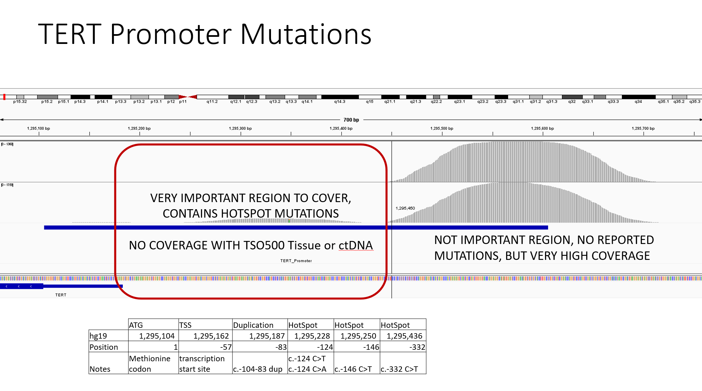

```{r setup, include=FALSE}
knitr::opts_chunk$set(echo = TRUE)
```

```{r, message=FALSE, warning=FALSE}
### Required packages.
library(here)
library(dplyr)
library(tidyverse)
library(stringr)
library(DT)
```

***

## Introduction

The TERT promoter region is on chr5:1295105-1295605). We are interested in the coverage of part of this region (1295105–1295450) for TSO500 data.

We would like to look at the coverage of the region of interest, the remaining TERT region (chr5:1295450-1295605), and a ratio of the two.



## Data

The TSO500 alignment files used for calculating coverage exist in GDS. The script used to run [mosdepth tool](https://github.com/brentp/mosdepth) on these bams for ~240 samples can be found [here](./scripts/run_cttso_bams_through_mosdepth.sh)

mosdepth can output the mean per-region given a BED file of regions. The result is summarised in the table below:


```{r raw_cov_results, message=FALSE, warning=FALSE}
# list files in the input directory
list_of_files <- list.files(path = params$mosdepth_output,
                            recursive = TRUE,
                            pattern = "\\.bed.gz$",
                            full.names = TRUE)

# read files and prepare data format for display
df <- list_of_files %>%
  set_names() %>%
  map_df(read.table,
         .id = "sample_id",
         col.names = c("chr", "region_start", "region_end", "mean_coverage" )) %>%
  mutate(sample_id = tools::file_path_sans_ext(basename(sample_id))) %>%
  mutate(sample_id = gsub(".regions.bed", "", sample_id)) %>%
  dplyr::select(sample_id, region_start, region_end, mean_coverage)

# display input data in a table
datatable(df, rownames = FALSE, filter="top", options = list(pageLength = 5, scrollX=T), caption = "Mean coverage of TERT promoter region and region of interest")
```

## Coverage plot

The mean coverage ratio for the cttso500 samples can be found in the table below.

Also, it's recommended to view the coverage plot on a bigger screen, as the number of samples and data points is large. 

```{r prepare_data, message=FALSE, warning=FALSE, results='hide'}
#read input
coverage_beds <-list.files(params$mosdepth_output,
           full.names = T)

dat <- data.frame(matrix(ncol = 2, nrow = 0))
colnames(dat) = c("sample", "mean_coverage_ratio")
file <- data.frame()

for (i in 1:length(coverage_beds)){
  print(coverage_beds[i])
  file <- read.table(coverage_beds[i],col.names = c("chr", "region_start", "region_end", "mean_coverage" )) %>%
    mutate(sample_name = basename(coverage_beds[i])) %>%
    mutate(sample_name = gsub(".regions.bed.gz", "", sample_name)) %>%
    mutate(ratio = mean_coverage[1] / mean_coverage[2]) %>%
    distinct(.keep_all = FALSE)


  sample_name = unique(file$sample_name)
  ratio_mean_cov = unique(file$ratio)

  dat[nrow(dat) + 1, ] <- c(sample_name, round(ratio_mean_cov, 2))
}

# sort ratio
dat <- dat[order(dat$mean_coverage_ratio),]
# convert ratio values to numeric and omit nan values
dat$mean_coverage_ratio <- as.numeric(as.character(dat$mean_coverage_ratio))
dat <- na.omit(dat)

```

``` {r coverage_plot, message=FALSE, warning=FALSE,}
# display data in a table
datatable(dat, rownames = FALSE, filter="top", options = list(pageLength = 5, scrollX=T), caption = "Ratio of mean coverage of TERT promoter region and region of interest")

# plot results https://r-graph-gallery.com/267-reorder-a-variable-in-ggplot2.html
dat %>%
  arrange(mean_coverage_ratio) %>%
  mutate(sample=factor(sample, levels=sample)) %>% # This trick update the factor levels
  ggplot( aes(x=mean_coverage_ratio, y=sample)) +
  geom_segment( aes(xend=0, yend=sample)) +
  geom_point( size=4, color="orange") +
  coord_flip() +
  theme(axis.text.x = element_text(angle = 90, vjust = 0.5, hjust=1)) +
  xlab("") +
  ylab("coverage_ratio")
```
