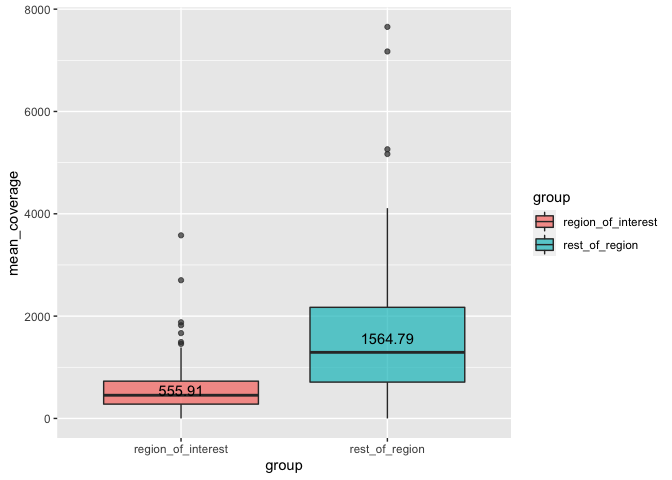

```r
### Required packages.
library(here)
library(dplyr)
library(tidyverse)
library(stringr)
library(DT)
```

***

## Introduction

The TERT promoter region is on chr5:1295105-1295605). We are interested in the coverage of part of this region (1295105–1295450) for TSO500 data.

We would like to look at the coverage of the region of interest, the remaining TERT region (chr5:1295450-1295605), and a ratio of the two.


## Data

The TSO500 alignment files used for calculating coverage exist in GDS. The script used to run [mosdepth tool](https://github.com/brentp/mosdepth) on these bams for ~240 samples can be found [here](./scripts/run_cttso_bams_through_mosdepth.sh)

mosdepth can output the mean per-region given a BED file of regions. The result is summarised in the table below:


```r
# list files in the input directory
list_of_files <- list.files(path = params$mosdepth_output,
                            recursive = TRUE,
                            pattern = "\\.bed.gz$",
                            full.names = TRUE)

# read files and prepare data format for display
df <- list_of_files %>%
  set_names() %>%
  map_df(read.table,
         .id = "sample_id",
         col.names = c("chr", "region_start", "region_end", "mean_coverage" )) %>%
  mutate(sample_id = tools::file_path_sans_ext(basename(sample_id))) %>%
  mutate(sample_id = gsub(".regions.bed", "", sample_id)) %>%
  dplyr::select(sample_id, region_start, region_end, mean_coverage)

# display input data in a table
datatable(df, rownames = FALSE, filter="top", options = list(pageLength = 5, scrollX=T), caption = "Mean coverage of TERT promoter region and region of interest")
```

```{=html}
<div id="htmlwidget-6628541033269e6f2c8a" style="width:100%;height:auto;" class="datatables html-widget"></div>
<script type="application/json" data-for="htmlwidget-6628541033269e6f2c8a">{"x":{"filter":"top","vertical":false,"filterHTML":"<tr>\n  <td data-type=\"character\" style=\"vertical-align: top;\">\n    <div class=\"form-group has-feedback\" style=\"margin-bottom: auto;\">\n      <input type=\"search\" placeholder=\"All\" class=\"form-control\" style=\"width: 100%;\"/>\n      <span class=\"glyphicon glyphicon-remove-circle form-control-feedback\"><\/span>\n    <\/div>\n  <\/td>\n  <td data-type=\"integer\" style=\"vertical-align: top;\">\n    <div class=\"form-group has-feedback\" style=\"margin-bottom: auto;\">\n      <input type=\"search\" placeholder=\"All\" class=\"form-control\" style=\"width: 100%;\"/>\n      <span class=\"glyphicon glyphicon-remove-circle form-control-feedback\"><\/span>\n    <\/div>\n    <div style=\"display: none;position: absolute;width: 200px;opacity: 1\">\n      <div data-min=\"1295105\" data-max=\"1295450\"><\/div>\n      <span style=\"float: left;\"><\/span>\n      <span style=\"float: right;\"><\/span>\n    <\/div>\n  <\/td>\n  <td data-type=\"integer\" style=\"vertical-align: top;\">\n    <div class=\"form-group has-feedback\" style=\"margin-bottom: auto;\">\n      <input type=\"search\" placeholder=\"All\" class=\"form-control\" style=\"width: 100%;\"/>\n      <span class=\"glyphicon glyphicon-remove-circle form-control-feedback\"><\/span>\n    <\/div>\n    <div style=\"display: none;position: absolute;width: 200px;opacity: 1\">\n      <div data-min=\"1295450\" data-max=\"1295605\"><\/div>\n      <span style=\"float: left;\"><\/span>\n      <span style=\"float: right;\"><\/span>\n    <\/div>\n  <\/td>\n  <td data-type=\"number\" style=\"vertical-align: top;\">\n    <div class=\"form-group has-feedback\" style=\"margin-bottom: auto;\">\n      <input type=\"search\" placeholder=\"All\" class=\"form-control\" style=\"width: 100%;\"/>\n      <span class=\"glyphicon glyphicon-remove-circle form-control-feedback\"><\/span>\n    <\/div>\n    <div style=\"display: none;position: absolute;width: 200px;opacity: 1\">\n      <div data-min=\"0\" data-max=\"7653.46\" data-scale=\"2\"><\/div>\n      <span style=\"float: left;\"><\/span>\n      <span style=\"float: right;\"><\/span>\n    <\/div>\n  <\/td>\n<\/tr>","caption":"<caption>Mean coverage of TERT promoter region and region of interest<\/caption>","data":[["MDX200144_L2100176_rerun","MDX200144_L2100176_rerun","MDX210140_L2101394","MDX210140_L2101394","MDX210155_L2101395","MDX210155_L2101395","MDX210246_L2101404","MDX210246_L2101404","MDX210265_L2101500","MDX210265_L2101500","MDX210267_L2101501","MDX210267_L2101501","MDX210274_L2101396","MDX210274_L2101396","MDX210279_L2101502","MDX210279_L2101502","MDX210333_L2101397","MDX210333_L2101397","MDX210352_L2101503","MDX210352_L2101503","MDX210353_L2101398","MDX210353_L2101398","MDX210357_L2101504","MDX210357_L2101504","MDX210367_L2101505","MDX210367_L2101505","MDX210381_L2101405","MDX210381_L2101405","MDX210390_L2101399","MDX210390_L2101399","MDX210394_L2101406","MDX210394_L2101406","MDX210398_L2101407","MDX210398_L2101407","MDX210402_L2101508","MDX210402_L2101508","MDX210406_L2101509","MDX210406_L2101509","MDX210416_L2101510","MDX210416_L2101510","MDX210420_L2101621","MDX210420_L2101621","MDX210434_L2101622","MDX210434_L2101622","MDX210444_L2101623","MDX210444_L2101623","MDX210454_L2101624","MDX210454_L2101624","MDX210458_L2200032","MDX210458_L2200032","MDX210466_L2200033","MDX210466_L2200033","MDX210470_L2200034","MDX210470_L2200034","MDX210474_L2200035","MDX210474_L2200035","MDX210477_L2200036","MDX210477_L2200036","MDX210483_L2200037","MDX210483_L2200037","MDX220013_L2200197","MDX220013_L2200197","MDX220023_L2200277","MDX220023_L2200277","MDX220038_L2200199","MDX220038_L2200199","MDX220043_L2200200","MDX220043_L2200200","MDX220047_L2200278","MDX220047_L2200278","MDX220062_L2200280","MDX220062_L2200280","MDX220064_L2200281","MDX220064_L2200281","MDX220073_L2200282","MDX220073_L2200282","MDX220080_L2200596","MDX220080_L2200596","MDX220084_L2200589","MDX220084_L2200589","MDX220094_L2200597","MDX220094_L2200597","MDX220098_L2200598","MDX220098_L2200598","MDX220104_L2200590","MDX220104_L2200590","MDX220110_L2200591","MDX220110_L2200591","MDX220116_L2200599","MDX220116_L2200599","MDX220124_L2200600","MDX220124_L2200600","MDX220130_L2200592","MDX220130_L2200592","MDX220135_L2200601","MDX220135_L2200601","MDX220141_L2200593","MDX220141_L2200593","MDX220145_L2200602","MDX220145_L2200602","NTC_ctTSO210308KC_L2100185_rerun","NTC_ctTSO210308KC_L2100185_rerun","NTC_ctTSO210427VD_L2100360","NTC_ctTSO210427VD_L2100360","NTC_ctTSO211110_L2101417","NTC_ctTSO211110_L2101417","NTC_ctTSO211123BY_L2101520","NTC_ctTSO211123BY_L2101520","NTC_ctTSO211207_L2101644","NTC_ctTSO211207_L2101644","NTC_ctTSO220118_L2200055","NTC_ctTSO220118_L2200055","PRJ200199_L2100344","PRJ200199_L2100344","PRJ200580_L2100162","PRJ200580_L2100162","PRJ200581_L2100163","PRJ200581_L2100163","PRJ200582_L2100164","PRJ200582_L2100164","PRJ200583_L2100165","PRJ200583_L2100165","PRJ200584_L2100166","PRJ200584_L2100166","PRJ200585_L2100167","PRJ200585_L2100167","PRJ200586_L2100168","PRJ200586_L2100168","PRJ200587_L2100169","PRJ200587_L2100169","PRJ200588_L2100170_rerun","PRJ200588_L2100170_rerun","PRJ200589_L2100171_rerun","PRJ200589_L2100171_rerun","PRJ200590_L2100172_rerun","PRJ200590_L2100172_rerun","PRJ200591_L2100173_rerun","PRJ200591_L2100173_rerun","PRJ200592_L2100174_rerun","PRJ200592_L2100174_rerun","PRJ200593_L2100175_rerun","PRJ200593_L2100175_rerun","PRJ200603_L2100345","PRJ200603_L2100345","PRJ200606_L2101409","PRJ200606_L2101409","PRJ200626_L2100182_rerun","PRJ200626_L2100182_rerun","PRJ200627_L2100183_rerun","PRJ200627_L2100183_rerun","PRJ200628_L2100184_rerun","PRJ200628_L2100184_rerun","PRJ200629_L2100340","PRJ200629_L2100340","PRJ200630_L2100341","PRJ200630_L2100341","PRJ200631_L2100342","PRJ200631_L2100342","PRJ200654_L2100343","PRJ200654_L2100343","PRJ210008_L2100347","PRJ210008_L2100347","PRJ210009_L2100348","PRJ210009_L2100348","PRJ210010_L2100349","PRJ210010_L2100349","PRJ210011_L2100350","PRJ210011_L2100350","PRJ210012_L2100351","PRJ210012_L2100351","PRJ210013_L2100352","PRJ210013_L2100352","PRJ210014_L2100353","PRJ210014_L2100353","PRJ210015_L2100354","PRJ210015_L2100354","PRJ210016_L2100355","PRJ210016_L2100355","PRJ210017_L2100356","PRJ210017_L2100356","PRJ210018_L2100357","PRJ210018_L2100357","PRJ210019_L2100358","PRJ210019_L2100358","PRJ210020_L2100359","PRJ210020_L2100359","PRJ210031_L2101410","PRJ210031_L2101410","PRJ210052_L2101411","PRJ210052_L2101411","PRJ210056_L2100346","PRJ210056_L2100346","PRJ210059_L2101412","PRJ210059_L2101412","PRJ210060_L2101413","PRJ210060_L2101413","PRJ210065_L2101414","PRJ210065_L2101414","PRJ210067_L2101415","PRJ210067_L2101415","PRJ210068_L2101511","PRJ210068_L2101511","PRJ210069_L2101512","PRJ210069_L2101512","PRJ210078_L2101513","PRJ210078_L2101513","PRJ210087_L2101514","PRJ210087_L2101514","PRJ210115_L2101515","PRJ210115_L2101515","PRJ210117_L2101517","PRJ210117_L2101517","PRJ210123_L2101518","PRJ210123_L2101518","PRJ210124_L2101519","PRJ210124_L2101519","PRJ210131_L2200291","PRJ210131_L2200291","PRJ210164_L2200292","PRJ210164_L2200292","PRJ210165_L2200293","PRJ210165_L2200293","PRJ210177_L2200294","PRJ210177_L2200294","PRJ210279_L2101506","PRJ210279_L2101506","PRJ210363_L2200295","PRJ210363_L2200295","PRJ210365_L2200296","PRJ210365_L2200296","PRJ210367_L2200297","PRJ210367_L2200297","PRJ210368_L2200298","PRJ210368_L2200298","PRJ210370_L2101401","PRJ210370_L2101401","PRJ210442_L2101408","PRJ210442_L2101408","PRJ210636_L2200395","PRJ210636_L2200395","PRJ210637_L2200396","PRJ210637_L2200396","PRJ210859_L2101402","PRJ210859_L2101402","PRJ210860_L2101403","PRJ210860_L2101403","PRJ211039_L2101507","PRJ211039_L2101507","PRJ211135_L2101625","PRJ211135_L2101625","PRJ211144_L2101626","PRJ211144_L2101626","PRJ211145_L2101627","PRJ211145_L2101627","PRJ211146_L2101628","PRJ211146_L2101628","PRJ211147_L2101629","PRJ211147_L2101629","PRJ211151_L2101630","PRJ211151_L2101630","PRJ211152_L2101631","PRJ211152_L2101631","PRJ211153_L2101632","PRJ211153_L2101632","PRJ211154_L2101633","PRJ211154_L2101633","PRJ211155_L2101634","PRJ211155_L2101634","PRJ211156_L2101635","PRJ211156_L2101635","PRJ211157_L2101636","PRJ211157_L2101636","PRJ211158_L2101637","PRJ211158_L2101637","PRJ211159_L2101638","PRJ211159_L2101638","PRJ211160_L2101639","PRJ211160_L2101639","PRJ211162_L2200038","PRJ211162_L2200038","PRJ211163_L2200039","PRJ211163_L2200039","PRJ211164_L2101640","PRJ211164_L2101640","PRJ211165_L2101641","PRJ211165_L2101641","PRJ211166_L2101642","PRJ211166_L2101642","PRJ211239_L2200040","PRJ211239_L2200040","PRJ211240_L2200041","PRJ211240_L2200041","PRJ211241_L2200042","PRJ211241_L2200042","PRJ211242_L2200043","PRJ211242_L2200043","PRJ211243_L2200044","PRJ211243_L2200044","PRJ211244_L2200045","PRJ211244_L2200045","PRJ211245_L2200046","PRJ211245_L2200046","PRJ211250_L2200047","PRJ211250_L2200047","PRJ211251_L2200048","PRJ211251_L2200048","PRJ211252_L2200049","PRJ211252_L2200049","PRJ211253_L2200050","PRJ211253_L2200050","PRJ211254_L2200051","PRJ211254_L2200051","PRJ211255_L2200052","PRJ211255_L2200052","PRJ211256_L2200053","PRJ211256_L2200053","PRJ211257_L2200145","PRJ211257_L2200145","PRJ211258_L2200146","PRJ211258_L2200146","PRJ211259_L2200147","PRJ211259_L2200147","PRJ211260_L2200148","PRJ211260_L2200148","PRJ211261_L2200149","PRJ211261_L2200149","PRJ220013_L2200150","PRJ220013_L2200150","PRJ220014_L2200151","PRJ220014_L2200151","PRJ220015_L2200152","PRJ220015_L2200152","PRJ220017_L2200154","PRJ220017_L2200154","PRJ220018_L2200155","PRJ220018_L2200155","PRJ220019_L2200156","PRJ220019_L2200156","PRJ220020_L2200157","PRJ220020_L2200157","PRJ220021_L2200158","PRJ220021_L2200158","PRJ220022_L2200159","PRJ220022_L2200159","PRJ220023_L2200160","PRJ220023_L2200160","PRJ220025_L2200162","PRJ220025_L2200162","PRJ220026_L2200163","PRJ220026_L2200163","PRJ220027_L2200164","PRJ220027_L2200164","PRJ220028_L2200165","PRJ220028_L2200165","PRJ220029_L2200166","PRJ220029_L2200166","PRJ220030_L2200201","PRJ220030_L2200201","PRJ220031_L2200202","PRJ220031_L2200202","PRJ220032_L2200203","PRJ220032_L2200203","PRJ220033_L2200204","PRJ220033_L2200204","PRJ220034_L2200205","PRJ220034_L2200205","PRJ220035_L2200206","PRJ220035_L2200206","PRJ220036_L2200207","PRJ220036_L2200207","PRJ220418_L2200208","PRJ220418_L2200208","PRJ220419_L2200209","PRJ220419_L2200209","PRJ220420_L2200210","PRJ220420_L2200210","PRJ220421_L2200211","PRJ220421_L2200211","PRJ220423_L2200212","PRJ220423_L2200212","PRJ220424_L2200213","PRJ220424_L2200213","PRJ220425_L2200214","PRJ220425_L2200214","PRJ220426_L2200215","PRJ220426_L2200215","PRJ220427_L2200216","PRJ220427_L2200216","PRJ220428_L2200217","PRJ220428_L2200217","PRJ220429_L2200218","PRJ220429_L2200218","PRJ220430_L2200283","PRJ220430_L2200283","PRJ220431_L2200284","PRJ220431_L2200284","PRJ220432_L2200285","PRJ220432_L2200285","PRJ220433_L2200286","PRJ220433_L2200286","PRJ220434_L2200397","PRJ220434_L2200397","PRJ220435_L2200398","PRJ220435_L2200398","PRJ220436_L2200287","PRJ220436_L2200287","PRJ220437_L2200288","PRJ220437_L2200288","PRJ220439_L2200290","PRJ220439_L2200290","PRJ220440_L2200399","PRJ220440_L2200399","PRJ220441_L2200400","PRJ220441_L2200400","PRJ220443_L2200401","PRJ220443_L2200401","PRJ220444_L2200402","PRJ220444_L2200402","PRJ220445_L2200403","PRJ220445_L2200403","PRJ220446_L2200404","PRJ220446_L2200404","PRJ220448_L2200405","PRJ220448_L2200405","PRJ220450_L2200406","PRJ220450_L2200406","PRJ220451_L2200407","PRJ220451_L2200407","PRJ220452_L2200408","PRJ220452_L2200408","PRJ220453_L2200409","PRJ220453_L2200409","PRJ220454_L2200410","PRJ220454_L2200410","PRJ220455_L2200411","PRJ220455_L2200411","PRJ220456_L2200412","PRJ220456_L2200412","PRJ220457_L2200413","PRJ220457_L2200413","PRJ220459_L2200414","PRJ220459_L2200414","PRJ220460_L2200415","PRJ220460_L2200415","PRJ220461_L2200416","PRJ220461_L2200416","PTC_ctTSO211110_L2101416","PTC_ctTSO211110_L2101416","PTC_ctTSO211207_L2101643","PTC_ctTSO211207_L2101643","PTC_ctTSO220118_L2200054","PTC_ctTSO220118_L2200054","PTC_ctTSO220207_L2200167","PTC_ctTSO220207_L2200167","PTC_ctTSO220221_L2200219","PTC_ctTSO220221_L2200219","PTC_ctTSO220314_L2200299","PTC_ctTSO220314_L2200299","PTC_ctTSO220404_L2200417","PTC_ctTSO220404_L2200417","PTC_HrznRefStd5pc_L2100177_rerun","PTC_HrznRefStd5pc_L2100177_rerun","PTC_HrznRefStd5pc_L2100337","PTC_HrznRefStd5pc_L2100337","PTC_HrznRefStd5pc_L2100338","PTC_HrznRefStd5pc_L2100338","PTC_SrSqCMM1pc_L2100178_rerun","PTC_SrSqCMM1pc_L2100178_rerun","PTC_SrSqCMM1pc_L2100179_rerun","PTC_SrSqCMM1pc_L2100179_rerun","PTC_SrSqCMM1pc_L2101499","PTC_SrSqCMM1pc_L2101499","PTC_SrSqMM05pcV2_L2100180_rerun","PTC_SrSqMM05pcV2_L2100180_rerun","PTC_SrSqMM1pcV2_L2100181_rerun","PTC_SrSqMM1pcV2_L2100181_rerun","PTC_SSqCMM05pc_L2100339","PTC_SSqCMM05pc_L2100339","PTC_SSqCMM05pc_L2101497","PTC_SSqCMM05pc_L2101497","PTC_SSqCMM05pc_L2101498","PTC_SSqCMM05pc_L2101498"],[1295105,1295450,1295105,1295450,1295105,1295450,1295105,1295450,1295105,1295450,1295105,1295450,1295105,1295450,1295105,1295450,1295105,1295450,1295105,1295450,1295105,1295450,1295105,1295450,1295105,1295450,1295105,1295450,1295105,1295450,1295105,1295450,1295105,1295450,1295105,1295450,1295105,1295450,1295105,1295450,1295105,1295450,1295105,1295450,1295105,1295450,1295105,1295450,1295105,1295450,1295105,1295450,1295105,1295450,1295105,1295450,1295105,1295450,1295105,1295450,1295105,1295450,1295105,1295450,1295105,1295450,1295105,1295450,1295105,1295450,1295105,1295450,1295105,1295450,1295105,1295450,1295105,1295450,1295105,1295450,1295105,1295450,1295105,1295450,1295105,1295450,1295105,1295450,1295105,1295450,1295105,1295450,1295105,1295450,1295105,1295450,1295105,1295450,1295105,1295450,1295105,1295450,1295105,1295450,1295105,1295450,1295105,1295450,1295105,1295450,1295105,1295450,1295105,1295450,1295105,1295450,1295105,1295450,1295105,1295450,1295105,1295450,1295105,1295450,1295105,1295450,1295105,1295450,1295105,1295450,1295105,1295450,1295105,1295450,1295105,1295450,1295105,1295450,1295105,1295450,1295105,1295450,1295105,1295450,1295105,1295450,1295105,1295450,1295105,1295450,1295105,1295450,1295105,1295450,1295105,1295450,1295105,1295450,1295105,1295450,1295105,1295450,1295105,1295450,1295105,1295450,1295105,1295450,1295105,1295450,1295105,1295450,1295105,1295450,1295105,1295450,1295105,1295450,1295105,1295450,1295105,1295450,1295105,1295450,1295105,1295450,1295105,1295450,1295105,1295450,1295105,1295450,1295105,1295450,1295105,1295450,1295105,1295450,1295105,1295450,1295105,1295450,1295105,1295450,1295105,1295450,1295105,1295450,1295105,1295450,1295105,1295450,1295105,1295450,1295105,1295450,1295105,1295450,1295105,1295450,1295105,1295450,1295105,1295450,1295105,1295450,1295105,1295450,1295105,1295450,1295105,1295450,1295105,1295450,1295105,1295450,1295105,1295450,1295105,1295450,1295105,1295450,1295105,1295450,1295105,1295450,1295105,1295450,1295105,1295450,1295105,1295450,1295105,1295450,1295105,1295450,1295105,1295450,1295105,1295450,1295105,1295450,1295105,1295450,1295105,1295450,1295105,1295450,1295105,1295450,1295105,1295450,1295105,1295450,1295105,1295450,1295105,1295450,1295105,1295450,1295105,1295450,1295105,1295450,1295105,1295450,1295105,1295450,1295105,1295450,1295105,1295450,1295105,1295450,1295105,1295450,1295105,1295450,1295105,1295450,1295105,1295450,1295105,1295450,1295105,1295450,1295105,1295450,1295105,1295450,1295105,1295450,1295105,1295450,1295105,1295450,1295105,1295450,1295105,1295450,1295105,1295450,1295105,1295450,1295105,1295450,1295105,1295450,1295105,1295450,1295105,1295450,1295105,1295450,1295105,1295450,1295105,1295450,1295105,1295450,1295105,1295450,1295105,1295450,1295105,1295450,1295105,1295450,1295105,1295450,1295105,1295450,1295105,1295450,1295105,1295450,1295105,1295450,1295105,1295450,1295105,1295450,1295105,1295450,1295105,1295450,1295105,1295450,1295105,1295450,1295105,1295450,1295105,1295450,1295105,1295450,1295105,1295450,1295105,1295450,1295105,1295450,1295105,1295450,1295105,1295450,1295105,1295450,1295105,1295450,1295105,1295450,1295105,1295450,1295105,1295450,1295105,1295450,1295105,1295450,1295105,1295450,1295105,1295450,1295105,1295450,1295105,1295450,1295105,1295450,1295105,1295450,1295105,1295450,1295105,1295450,1295105,1295450,1295105,1295450,1295105,1295450,1295105,1295450,1295105,1295450,1295105,1295450,1295105,1295450,1295105,1295450,1295105,1295450,1295105,1295450,1295105,1295450,1295105,1295450,1295105,1295450,1295105,1295450,1295105,1295450,1295105,1295450,1295105,1295450,1295105,1295450,1295105,1295450,1295105,1295450,1295105,1295450,1295105,1295450,1295105,1295450,1295105,1295450,1295105,1295450,1295105,1295450,1295105,1295450,1295105,1295450,1295105,1295450,1295105,1295450,1295105,1295450,1295105,1295450,1295105,1295450],[1295450,1295605,1295450,1295605,1295450,1295605,1295450,1295605,1295450,1295605,1295450,1295605,1295450,1295605,1295450,1295605,1295450,1295605,1295450,1295605,1295450,1295605,1295450,1295605,1295450,1295605,1295450,1295605,1295450,1295605,1295450,1295605,1295450,1295605,1295450,1295605,1295450,1295605,1295450,1295605,1295450,1295605,1295450,1295605,1295450,1295605,1295450,1295605,1295450,1295605,1295450,1295605,1295450,1295605,1295450,1295605,1295450,1295605,1295450,1295605,1295450,1295605,1295450,1295605,1295450,1295605,1295450,1295605,1295450,1295605,1295450,1295605,1295450,1295605,1295450,1295605,1295450,1295605,1295450,1295605,1295450,1295605,1295450,1295605,1295450,1295605,1295450,1295605,1295450,1295605,1295450,1295605,1295450,1295605,1295450,1295605,1295450,1295605,1295450,1295605,1295450,1295605,1295450,1295605,1295450,1295605,1295450,1295605,1295450,1295605,1295450,1295605,1295450,1295605,1295450,1295605,1295450,1295605,1295450,1295605,1295450,1295605,1295450,1295605,1295450,1295605,1295450,1295605,1295450,1295605,1295450,1295605,1295450,1295605,1295450,1295605,1295450,1295605,1295450,1295605,1295450,1295605,1295450,1295605,1295450,1295605,1295450,1295605,1295450,1295605,1295450,1295605,1295450,1295605,1295450,1295605,1295450,1295605,1295450,1295605,1295450,1295605,1295450,1295605,1295450,1295605,1295450,1295605,1295450,1295605,1295450,1295605,1295450,1295605,1295450,1295605,1295450,1295605,1295450,1295605,1295450,1295605,1295450,1295605,1295450,1295605,1295450,1295605,1295450,1295605,1295450,1295605,1295450,1295605,1295450,1295605,1295450,1295605,1295450,1295605,1295450,1295605,1295450,1295605,1295450,1295605,1295450,1295605,1295450,1295605,1295450,1295605,1295450,1295605,1295450,1295605,1295450,1295605,1295450,1295605,1295450,1295605,1295450,1295605,1295450,1295605,1295450,1295605,1295450,1295605,1295450,1295605,1295450,1295605,1295450,1295605,1295450,1295605,1295450,1295605,1295450,1295605,1295450,1295605,1295450,1295605,1295450,1295605,1295450,1295605,1295450,1295605,1295450,1295605,1295450,1295605,1295450,1295605,1295450,1295605,1295450,1295605,1295450,1295605,1295450,1295605,1295450,1295605,1295450,1295605,1295450,1295605,1295450,1295605,1295450,1295605,1295450,1295605,1295450,1295605,1295450,1295605,1295450,1295605,1295450,1295605,1295450,1295605,1295450,1295605,1295450,1295605,1295450,1295605,1295450,1295605,1295450,1295605,1295450,1295605,1295450,1295605,1295450,1295605,1295450,1295605,1295450,1295605,1295450,1295605,1295450,1295605,1295450,1295605,1295450,1295605,1295450,1295605,1295450,1295605,1295450,1295605,1295450,1295605,1295450,1295605,1295450,1295605,1295450,1295605,1295450,1295605,1295450,1295605,1295450,1295605,1295450,1295605,1295450,1295605,1295450,1295605,1295450,1295605,1295450,1295605,1295450,1295605,1295450,1295605,1295450,1295605,1295450,1295605,1295450,1295605,1295450,1295605,1295450,1295605,1295450,1295605,1295450,1295605,1295450,1295605,1295450,1295605,1295450,1295605,1295450,1295605,1295450,1295605,1295450,1295605,1295450,1295605,1295450,1295605,1295450,1295605,1295450,1295605,1295450,1295605,1295450,1295605,1295450,1295605,1295450,1295605,1295450,1295605,1295450,1295605,1295450,1295605,1295450,1295605,1295450,1295605,1295450,1295605,1295450,1295605,1295450,1295605,1295450,1295605,1295450,1295605,1295450,1295605,1295450,1295605,1295450,1295605,1295450,1295605,1295450,1295605,1295450,1295605,1295450,1295605,1295450,1295605,1295450,1295605,1295450,1295605,1295450,1295605,1295450,1295605,1295450,1295605,1295450,1295605,1295450,1295605,1295450,1295605,1295450,1295605,1295450,1295605,1295450,1295605,1295450,1295605,1295450,1295605,1295450,1295605,1295450,1295605,1295450,1295605,1295450,1295605,1295450,1295605,1295450,1295605,1295450,1295605,1295450,1295605,1295450,1295605,1295450,1295605,1295450,1295605,1295450,1295605,1295450,1295605,1295450,1295605],[808.28,2084.19,718.29,2437.54,1190.28,3761.25,453.29,1797.1,335.98,1226.96,355.87,1418.32,725.91,2703.27,428.05,1359.54,557.34,2780.14,308.49,932.24,1879.75,5168.6,224.65,662.95,502.26,911.83,288.96,1267.35,792.12,3417.54,572.77,2070.53,470.99,1732.85,411.36,1780.65,310.03,1730.49,514.77,2255.41,451.22,976.19,596.66,1020.77,608.78,1009.97,678.68,1148.59,192.51,823.53,275.1,672.03,336.95,659.71,299.12,589.28,291.06,595.41,99.67,164.9,214.75,511.16,0,0,240.18,439.28,379.52,560.03,343.24,540.63,197.55,376.54,283.15,499.25,148.48,314.21,843.77,1973.75,864.17,3945.17,485.77,1276.68,407.63,1006.28,734.76,2248.85,454.1,1792.21,394.53,1170.94,360.37,1367.52,501.63,1937.76,222.04,436.49,587.14,1227.32,1010.08,1998.3,0,0,0,0,0.81,2.32,0,0,0,0,0,0,2701.77,7173.06,1283.1,3819.82,896.36,2677,1285.85,3903.83,538.44,1936.19,1053.41,3265.26,828.25,3697.59,733.12,3038.06,319.37,1708.86,673.06,2226.26,1172.24,2877.83,1209.84,3025.1,1152.26,3182.28,1821.46,5261.25,3579.22,7653.46,1358.61,2744.36,711.69,2372.58,1308.18,2816.77,515.71,1771.4,581.69,1937.1,521.86,1851.3,575.86,1904.17,633.92,2948.21,860.82,1775.86,846.19,2966.81,640.66,2320.97,1095.75,3756.47,868.69,3502.26,802.06,2485.96,738.11,2597.61,1003.94,2951.74,1186.99,2869.43,1386.74,3517.88,1492.51,3902.66,892.32,3136.45,625.32,2168.32,587.65,2506.75,736.23,2033.3,728.56,1908.5,1357.29,3003.88,477.37,2026.49,340.79,1768.56,759.67,2096.65,314.58,1428.87,468.93,1903.07,430.4,1682.59,806.27,1651.83,422.49,2311.85,398.41,2089.46,503.4,2728.95,536.69,1987.16,547.56,2089.04,263.31,1090.52,305.52,1981.76,484.61,1686.61,696.8,1612.84,268.44,1056.83,816.26,1890.3,731.34,1799.46,759.95,1800.89,287.91,1344.55,671.2,2230.09,375.57,1369.77,485.88,1994.03,768.95,2215.5,389.04,1076.12,970.91,2290.26,230.57,943.76,515.51,889.53,482.03,1164.37,219.8,826.18,149.09,822.33,439.45,800.59,466.83,825.95,410.76,632.56,415.53,675.1,643.78,1132.9,418.83,917.49,195.94,673.27,259.4,728.94,284.34,758.12,441.08,807.97,417.78,685.79,193.79,744.79,126.36,558.6,430.92,626.92,371.29,551.1,293.81,543.82,101.83,288.15,423.56,760.51,778.69,1422.48,440.01,944.68,548.57,1117.27,243.66,711.32,163.16,710.25,198.84,1288.3,386.95,1144.7,502.48,1112.15,372.86,684.4,1224.54,1503.43,1134.65,1720.48,260.44,711.27,269.31,1263.46,244.9,752.42,563.76,1291.72,525.3,1079.5,388.75,753.25,235.84,561.23,169.08,627.79,100.92,571.82,410.99,821.91,377.92,698.86,504.69,879.73,300.12,547.58,228.41,495.79,190.19,823.41,52.1,457.48,172.4,435.3,204.21,360.56,102.55,290.21,195.98,425.69,67.6,245.79,522.84,816.8,295.02,545.44,486.92,1376.11,131.29,493.83,416.16,800.79,1457.59,2786.32,429.15,710.46,381.37,585.31,321.59,574.46,238.96,528.44,175.7,551.68,106.04,589.92,282.09,760.21,466.13,907.12,518.4,789.17,544.88,907.72,307.17,683.04,289.58,750.26,173.28,392.97,92.29,457.2,55.67,238.12,230.1,484.28,148.17,346.81,270.79,744.94,192.63,407.34,279.86,550.57,170.18,400.86,656.42,2849.54,493.5,1986.86,223.6,854.21,302.27,1438.08,1667.75,3271.3,382.01,754.7,906.4,1646.75,1287.32,2276.92,1107.13,2383.74,707.59,1305.68,572.04,1312.74,799.7,1973.54,1275.2,2384.47,571.72,922.77,1250.9,2192.64,905.68,1863.92,1271.24,2268.32,616.01,1501.75,430.25,1732.35,590.74,2633.29,939.37,4110.67,130.15,868.57,361.91,1229.2,21.4,149.43,475.29,2171.97,1241.07,2124.23,1301.01,2233.33,1281.64,2241.79,429.32,2205.18,479.29,2321.68,294.03,2159.7,734.53,3231.97,725.04,2112.58,260.34,1909.85,703.43,3257.34,161.94,1056.58]],"container":"<table class=\"display\">\n  <thead>\n    <tr>\n      <th>sample_id<\/th>\n      <th>region_start<\/th>\n      <th>region_end<\/th>\n      <th>mean_coverage<\/th>\n    <\/tr>\n  <\/thead>\n<\/table>","options":{"pageLength":5,"scrollX":true,"columnDefs":[{"className":"dt-right","targets":[1,2,3]}],"order":[],"autoWidth":false,"orderClasses":false,"orderCellsTop":true,"lengthMenu":[5,10,25,50,100]}},"evals":[],"jsHooks":[]}</script>
```

## Coverage plot

The mean coverage ratio for the cttso500 samples can be found in the table below.

Also, it's recommended to view the coverage plot on a bigger screen, as the number of samples and data points is large. 


```r
#read input
coverage_beds <-list.files(params$mosdepth_output,
           full.names = T)

dat <- data.frame(matrix(ncol = 2, nrow = 0))
colnames(dat) = c("sample", "mean_coverage_ratio")
file <- data.frame()

for (i in 1:length(coverage_beds)){
  print(coverage_beds[i])
  file <- read.table(coverage_beds[i],col.names = c("chr", "region_start", "region_end", "mean_coverage" )) %>%
    mutate(sample_name = basename(coverage_beds[i])) %>%
    mutate(sample_name = gsub(".regions.bed.gz", "", sample_name)) %>%
    mutate(ratio = mean_coverage[1] / mean_coverage[2]) %>%
    distinct(.keep_all = FALSE)


  sample_name = unique(file$sample_name)
  ratio_mean_cov = unique(file$ratio)

  dat[nrow(dat) + 1, ] <- c(sample_name, round(ratio_mean_cov, 2))
}

# sort ratio
dat <- dat[order(dat$mean_coverage_ratio),]
# convert ratio values to numeric and omit nan values
dat$mean_coverage_ratio <- as.numeric(as.character(dat$mean_coverage_ratio))
dat <- na.omit(dat)
```


```r
# display data in a table
datatable(dat, rownames = FALSE, filter="top", options = list(pageLength = 5, scrollX=T), caption = "Ratio of mean coverage of TERT promoter region and region of interest")
```

```{=html}
<div id="htmlwidget-7cb0963844e66752aaa3" style="width:100%;height:auto;" class="datatables html-widget"></div>
<script type="application/json" data-for="htmlwidget-7cb0963844e66752aaa3">{"x":{"filter":"top","vertical":false,"filterHTML":"<tr>\n  <td data-type=\"character\" style=\"vertical-align: top;\">\n    <div class=\"form-group has-feedback\" style=\"margin-bottom: auto;\">\n      <input type=\"search\" placeholder=\"All\" class=\"form-control\" style=\"width: 100%;\"/>\n      <span class=\"glyphicon glyphicon-remove-circle form-control-feedback\"><\/span>\n    <\/div>\n  <\/td>\n  <td data-type=\"number\" style=\"vertical-align: top;\">\n    <div class=\"form-group has-feedback\" style=\"margin-bottom: auto;\">\n      <input type=\"search\" placeholder=\"All\" class=\"form-control\" style=\"width: 100%;\"/>\n      <span class=\"glyphicon glyphicon-remove-circle form-control-feedback\"><\/span>\n    <\/div>\n    <div style=\"display: none;position: absolute;width: 200px;opacity: 1\">\n      <div data-min=\"0.11\" data-max=\"0.81\" data-scale=\"2\"><\/div>\n      <span style=\"float: left;\"><\/span>\n      <span style=\"float: right;\"><\/span>\n    <\/div>\n  <\/td>\n<\/tr>","caption":"<caption>Ratio of mean coverage of TERT promoter region and region of interest<\/caption>","data":[["PRJ220023_L2200160","PTC_ctTSO220314_L2200299","PTC_SrSqCMM1pc_L2101499","PTC_SSqCMM05pc_L2100339","PRJ210164_L2200292","PRJ211250_L2200047","PTC_ctTSO220207_L2200167","PTC_SSqCMM05pc_L2101498","MDX210406_L2101509","PRJ210087_L2101514","PRJ210117_L2101517","PRJ211146_L2101628","PRJ220015_L2200152","PRJ220423_L2200212","PRJ200587_L2100169","PRJ210060_L2101413","PRJ210115_L2101515","PTC_SrSqCMM1pc_L2100178_rerun","MDX210333_L2101397","PRJ220431_L2200284","PRJ210368_L2200298","PRJ211257_L2200145","PRJ220444_L2200402","PTC_SrSqCMM1pc_L2100179_rerun","MDX220084_L2200589","PRJ200585_L2100167","PRJ200631_L2100342","PRJ210067_L2101415","PTC_ctTSO211207_L2101643","PTC_ctTSO220404_L2200417","PTC_SSqCMM05pc_L2101497","MDX210381_L2101405","MDX210390_L2101399","MDX210402_L2101508","MDX210416_L2101510","MDX210458_L2200032","PRJ210020_L2100359","PRJ211163_L2200039","PRJ211245_L2200046","PRJ220022_L2200159","PRJ220432_L2200285","PRJ220440_L2200399","PTC_ctTSO220118_L2200054","PTC_SrSqMM05pcV2_L2100180_rerun","PRJ200586_L2100168","PRJ210059_L2101412","PRJ210131_L2200291","PRJ210636_L2200395","PRJ211039_L2101507","MDX210246_L2101404","MDX210267_L2101501","MDX220110_L2200591","PRJ210011_L2100350","PRJ210068_L2101511","PRJ210279_L2101506","PRJ220441_L2200400","PTC_ctTSO211110_L2101416","MDX220124_L2200600","MDX220130_L2200592","PRJ210069_L2101512","PRJ210124_L2101519","PRJ211162_L2200038","PRJ220443_L2200401","MDX210265_L2101500","MDX210274_L2101396","MDX210398_L2101407","PRJ210123_L2101518","PRJ210442_L2101408","PRJ211145_L2101627","PRJ220014_L2200151","PRJ220033_L2200204","MDX210394_L2101406","PRJ200583_L2100165","PRJ200629_L2100340","PRJ210009_L2100348","PRJ210013_L2100352","PRJ210018_L2100357","PRJ220029_L2200166","MDX210140_L2101394","PRJ200627_L2100183_rerun","PRJ210008_L2100347","PRJ210010_L2100349","PRJ210019_L2100358","PRJ210165_L2200293","PRJ211156_L2101635","PTC_ctTSO220221_L2200219","PRJ200588_L2100170_rerun","PRJ200606_L2101409","PRJ200628_L2100184_rerun","PRJ200630_L2100341","PRJ210370_L2101401","MDX210279_L2101502","MDX210155_L2101395","PRJ200584_L2100166","PRJ210012_L2100351","PRJ220421_L2200211","MDX210352_L2101503","MDX220104_L2200590","PRJ200581_L2100163","PRJ200582_L2100164","PRJ211258_L2200146","MDX210357_L2101504","MDX220116_L2200599","PRJ200580_L2100162","PRJ210014_L2100353","PRJ211244_L2200045","PRJ211251_L2200048","PTC_SrSqMM1pcV2_L2100181_rerun","NTC_ctTSO211110_L2101417","PRJ200592_L2100174_rerun","PRJ210637_L2200396","PRJ211239_L2200040","PRJ220027_L2200164","PRJ220032_L2200203","MDX210353_L2101398","PRJ200591_L2100173_rerun","PRJ210031_L2101410","PRJ210065_L2101414","PRJ210859_L2101402","PRJ211157_L2101636","PRJ220435_L2200398","PRJ211256_L2200053","PRJ220424_L2200213","MDX220094_L2200597","PRJ200199_L2100344","PRJ210017_L2100356","PRJ210052_L2101411","PRJ211158_L2101637","MDX200144_L2100176_rerun","PRJ210016_L2100355","PRJ220429_L2200218","PRJ200590_L2100172_rerun","PRJ220025_L2200162","MDX210466_L2200033","MDX220098_L2200598","PRJ200589_L2100171_rerun","PRJ210015_L2100354","PRJ210365_L2200296","PRJ211144_L2101626","PRJ220454_L2200410","PRJ220461_L2200416","MDX220013_L2200197","PRJ210367_L2200297","PRJ210860_L2101403","PRJ220013_L2200150","PRJ220439_L2200290","MDX220080_L2200596","PRJ210177_L2200294","PRJ210363_L2200295","PRJ220434_L2200397","PRJ211259_L2200147","PRJ220430_L2200283","PRJ220453_L2200409","PRJ210056_L2100346","PRJ211252_L2200049","PRJ220420_L2200210","PRJ220428_L2200217","MDX210420_L2101621","PRJ200626_L2100182_rerun","PRJ211155_L2101634","PRJ220021_L2200158","PRJ220028_L2200165","PRJ220451_L2200407","MDX220073_L2200282","PRJ200593_L2100175_rerun","PRJ211242_L2200043","PRJ220436_L2200287","MDX220141_L2200593","PRJ200654_L2100343","PRJ220433_L2200286","MDX210477_L2200036","PRJ210078_L2101513","PRJ211243_L2200044","PRJ211260_L2200148","PRJ220459_L2200414","PRJ200603_L2100345","PRJ220017_L2200154","MDX210470_L2200034","MDX210474_L2200035","MDX220135_L2200601","MDX220145_L2200602","PRJ220425_L2200214","PRJ220437_L2200288","PRJ220445_L2200403","PRJ220446_L2200404","MDX220062_L2200280","PRJ211261_L2200149","PRJ220034_L2200205","PRJ220035_L2200206","PRJ220455_L2200411","PRJ211166_L2101642","PRJ211253_L2200050","PRJ220018_L2200155","PRJ220031_L2200202","PRJ220452_L2200408","MDX210367_L2101505","MDX220038_L2200199","PRJ211147_L2101629","PRJ211159_L2101638","PRJ211241_L2200042","PRJ220020_L2200157","PRJ220448_L2200405","PRJ211240_L2200041","PRJ220419_L2200209","PRJ220460_L2200415","MDX220064_L2200281","PRJ211151_L2101630","PRJ211154_L2101633","PRJ220019_L2200156","PRJ220026_L2200163","PRJ220450_L2200406","PRJ220457_L2200413","PTC_HrznRefStd5pc_L2100338","MDX210434_L2101622","PRJ211135_L2101625","PTC_HrznRefStd5pc_L2100177_rerun","PTC_HrznRefStd5pc_L2100337","MDX210454_L2101624","MDX210444_L2101623","MDX210483_L2200037","PRJ220036_L2200207","PRJ220427_L2200216","PRJ211160_L2101639","PRJ211153_L2101632","PRJ220456_L2200412","MDX220047_L2200278","PRJ220030_L2200201","PRJ211152_L2101631","PRJ220418_L2200208","PRJ211255_L2200052","PRJ220426_L2200215","PRJ211165_L2101641","MDX220043_L2200200","PRJ211164_L2101640","PRJ211254_L2200051"],[0.11,0.14,0.14,0.14,0.15,0.15,0.15,0.15,0.18,0.18,0.18,0.18,0.18,0.18,0.19,0.19,0.19,0.19,0.2,0.2,0.21,0.21,0.21,0.21,0.22,0.22,0.22,0.22,0.22,0.22,0.22,0.23,0.23,0.23,0.23,0.23,0.23,0.23,0.23,0.23,0.23,0.23,0.23,0.23,0.24,0.24,0.24,0.24,0.24,0.25,0.25,0.25,0.25,0.25,0.25,0.25,0.25,0.26,0.26,0.26,0.26,0.26,0.26,0.27,0.27,0.27,0.27,0.27,0.27,0.27,0.27,0.28,0.28,0.28,0.28,0.28,0.28,0.28,0.29,0.29,0.29,0.29,0.29,0.29,0.29,0.29,0.3,0.3,0.3,0.3,0.3,0.31,0.32,0.32,0.32,0.32,0.33,0.33,0.33,0.33,0.33,0.34,0.34,0.34,0.34,0.34,0.34,0.34,0.35,0.35,0.35,0.35,0.35,0.35,0.36,0.36,0.36,0.36,0.36,0.36,0.36,0.37,0.37,0.38,0.38,0.38,0.38,0.38,0.39,0.39,0.39,0.4,0.4,0.41,0.41,0.41,0.41,0.41,0.41,0.41,0.41,0.42,0.42,0.42,0.42,0.42,0.43,0.43,0.43,0.43,0.44,0.44,0.44,0.45,0.45,0.45,0.45,0.46,0.46,0.46,0.46,0.46,0.46,0.47,0.47,0.47,0.47,0.48,0.48,0.48,0.49,0.49,0.49,0.49,0.49,0.5,0.5,0.51,0.51,0.51,0.51,0.51,0.51,0.51,0.51,0.52,0.52,0.52,0.52,0.53,0.54,0.54,0.54,0.54,0.54,0.55,0.55,0.55,0.55,0.55,0.55,0.55,0.56,0.56,0.56,0.57,0.57,0.57,0.57,0.57,0.57,0.57,0.57,0.58,0.58,0.58,0.58,0.59,0.6,0.6,0.6,0.6,0.61,0.62,0.62,0.63,0.64,0.65,0.65,0.66,0.66,0.67,0.68,0.69,0.81]],"container":"<table class=\"display\">\n  <thead>\n    <tr>\n      <th>sample<\/th>\n      <th>mean_coverage_ratio<\/th>\n    <\/tr>\n  <\/thead>\n<\/table>","options":{"pageLength":5,"scrollX":true,"columnDefs":[{"className":"dt-right","targets":1}],"order":[],"autoWidth":false,"orderClasses":false,"orderCellsTop":true,"lengthMenu":[5,10,25,50,100]}},"evals":[],"jsHooks":[]}</script>
```

```r
# plot results https://r-graph-gallery.com/267-reorder-a-variable-in-ggplot2.html
dat %>%
  arrange(mean_coverage_ratio) %>%
  mutate(sample=factor(sample, levels=sample)) %>% # This trick update the factor levels
  ggplot( aes(x=mean_coverage_ratio, y=sample)) +
  geom_segment( aes(xend=0, yend=sample)) +
  geom_point( size=4, color="orange") +
  coord_flip() +
  theme(axis.text.x = element_text(angle = 90, vjust = 0.5, hjust=1)) +
  xlab("") +
  ylab("coverage_ratio")
```

<!-- -->
