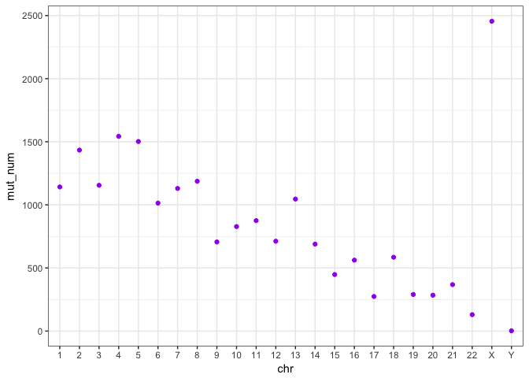
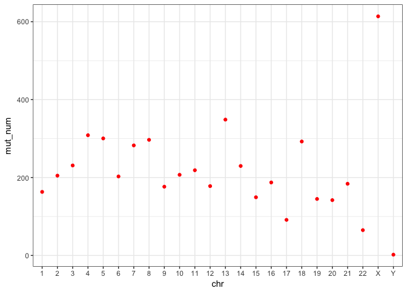
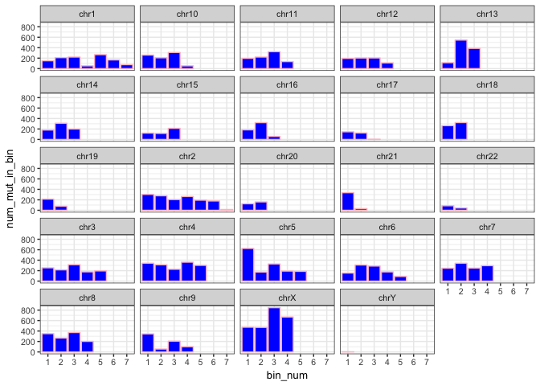

The report describes the work done for analysing and understanding TMB on one of the ensemble somatic variant calls (`/data/cephfs/punim0010/data/Results/Patients/CUP_SC932/final/umccrised/cup_tissue/somatic/ensemble-pon-pass.vcf.gz`). Many thanks to Peter for providing specific pointers and useful explanation on how to tackle various issues in R.

Required packages


```r
library(vcfR)
library(dplyr)
## Warning: package 'dplyr' was built under R version 3.5.1
library(ggplot2)
library(reticulate)
```

Input file


```r
vcf <-  read.vcfR("~/Documents/UMCCR/data/ensemble-pon-pass.vcf") # 20,361 variants in total
## Scanning file to determine attributes.
## File attributes:
##   meta lines: 343
##   header_line: 344
##   variant count: 20361
##   column count: 11
## 
Meta line 343 read in.
## All meta lines processed.
## gt matrix initialized.
## Character matrix gt created.
##   Character matrix gt rows: 20361
##   Character matrix gt cols: 11
##   skip: 0
##   nrows: 20361
##   row_num: 0
## 
Processed variant 1000
Processed variant 2000
Processed variant 3000
Processed variant 4000
Processed variant 5000
Processed variant 6000
Processed variant 7000
Processed variant 8000
Processed variant 9000
Processed variant 10000
Processed variant 11000
Processed variant 12000
Processed variant 13000
Processed variant 14000
Processed variant 15000
Processed variant 16000
Processed variant 17000
Processed variant 18000
Processed variant 19000
Processed variant 20000
Processed variant: 20361
## All variants processed
#head(vcf)
```

Have a named vector with chr + chr_length.
You can extract the chr_length for chr, and then bin based on that.
In a named vector, you can access each element by name such as chr_lengths[chr_you_want].


```r
chr_lengths <- c(249250621L, 243199373L, 198022430L, 191154276L,
                 180915260L, 171115067L, 159138663L, 146364022L,
                 141213431L, 135534747L, 135006516L, 133851895L,
                 115169878L, 107349540L, 102531392L,  90354753L,
                 81195210L,  78077248L,   59128983L,  63025520L,
                 48129895L,  51304566L,  155270560L,  59373566L)
chr_names <- c(1:22, "X", "Y")
names(chr_lengths) <- chr_names
```

Declare bin size (in bases)


```r
bin_size <- 40000000
```


```r
chrom <- vcfR::getCHROM(vcf)
x <- table(chrom)
x
## chrom
##    1   10   11   12   13   14   15   16   17   18   19    2   20   21   22 
## 1142  828  875  712 1046  689  448  562  274  585  290 1434  284  368  130 
##    3    4    5    6    7    8    9    X    Y 
## 1155 1543 1502 1014 1130 1187  706 2455    2
# How can I sort not alphanumerically
# Use gtools::mixedorder to get the ordered indices (or mixedsort to sort them)
sorted_ind <- gtools::mixedorder(names(x))
sorted_ind
##  [1]  1 12 16 17 18 19 20 21 22  2  3  4  5  6  7  8  9 10 11 13 14 15 23
## [24] 24
x <- x[sorted_ind]
x
## chrom
##    1    2    3    4    5    6    7    8    9   10   11   12   13   14   15 
## 1142 1434 1155 1543 1502 1014 1130 1187  706  828  875  712 1046  689  448 
##   16   17   18   19   20   21   22    X    Y 
##  562  274  585  290  284  368  130 2455    2
chr_fac <- factor(names(x), levels = gtools::mixedsort(names(x)))
chr_fac
##  [1] 1  2  3  4  5  6  7  8  9  10 11 12 13 14 15 16 17 18 19 20 21 22 X 
## [24] Y 
## 24 Levels: 1 2 3 4 5 6 7 8 9 10 11 12 13 14 15 16 17 18 19 20 21 22 ... Y
```

Get chromosome and filter vcf for that chromosome


```r
# takes a vcf and a chromosome
# outputs df with pos + chr for that chromosome
filter_chr <- function(x, vcf) {
  vcf_chr_pos <- data.frame(chr=getCHROM(vcf), pos=getPOS(vcf), stringsAsFactors = FALSE)
  return(filter(vcf_chr_pos, chr == x))
}
```

Prepare bins for the specific chromosome


```r
bin_chr <- function(chr_lengths, chr_name, bin_size) {
  return(seq(from = 0, to = chr_lengths[chr_name], by = bin_size))
}
```

Count mutations in a chromosome


```r
count_mut_per_bin <- function(chr_pos, bin_vec) {
  x <- cbind(chr_pos$pos, findInterval(chr_pos$pos, bin_vec))
  tab <- table(x[, 2])
  df <- data.frame(bin_num = names(tab),
                   num_mut_in_bin = c(unname(tab)),
                   stringsAsFactors = FALSE)
  df
}
```

Apply same function to all chromosomes. This gives a numerical vector containing the number of variants for each chromosome 


```r
results <- vector("numeric", length = length(chr_names))
for (i in 1:length(chr_names)) {
  results[i] <- mean(count_mut_per_bin(filter_chr(chr_names[i], vcf), bin_chr(chr_lengths, chr_names[i], bin_size))[, 2])
}
print(results)
##  [1] 163.14286 204.85714 231.00000 308.60000 300.40000 202.80000 282.50000
##  [8] 296.75000 176.50000 207.00000 218.75000 178.00000 348.66667 229.66667
## [15] 149.33333 187.33333  91.33333 292.50000 145.00000 142.00000 184.00000
## [22]  65.00000 613.75000   2.00000
```


* Calculate number of mutations per bin for chromosomes 1, 2, 11:


```r
results2 <- vector("list", length = length(chr_names))
for (i in 1:length(chr_names)) {
  results2[[i]] <- count_mut_per_bin(filter_chr(chr_names[i], vcf), bin_chr(chr_lengths, chr_names[i], bin_size))
}
```

* Turn a list that contains X data.frames to a single data.frame


```r
names(results2) <- paste("chr", chr_names, sep = "")
str(results2)
## List of 24
##  $ chr1 :'data.frame':	7 obs. of  2 variables:
##   ..$ bin_num       : chr [1:7] "1" "2" "3" "4" ...
##   ..$ num_mut_in_bin: int [1:7] 150 210 221 53 267 166 75
##  $ chr2 :'data.frame':	7 obs. of  2 variables:
##   ..$ bin_num       : chr [1:7] "1" "2" "3" "4" ...
##   ..$ num_mut_in_bin: int [1:7] 303 277 205 263 193 178 15
##  $ chr3 :'data.frame':	5 obs. of  2 variables:
##   ..$ bin_num       : chr [1:5] "1" "2" "3" "4" ...
##   ..$ num_mut_in_bin: int [1:5] 254 215 314 177 195
##  $ chr4 :'data.frame':	5 obs. of  2 variables:
##   ..$ bin_num       : chr [1:5] "1" "2" "3" "4" ...
##   ..$ num_mut_in_bin: int [1:5] 342 312 226 362 301
##  $ chr5 :'data.frame':	5 obs. of  2 variables:
##   ..$ bin_num       : chr [1:5] "1" "2" "3" "4" ...
##   ..$ num_mut_in_bin: int [1:5] 624 172 328 192 186
##  $ chr6 :'data.frame':	5 obs. of  2 variables:
##   ..$ bin_num       : chr [1:5] "1" "2" "3" "4" ...
##   ..$ num_mut_in_bin: int [1:5] 154 308 288 176 88
##  $ chr7 :'data.frame':	4 obs. of  2 variables:
##   ..$ bin_num       : chr [1:4] "1" "2" "3" "4"
##   ..$ num_mut_in_bin: int [1:4] 246 341 248 295
##  $ chr8 :'data.frame':	4 obs. of  2 variables:
##   ..$ bin_num       : chr [1:4] "1" "2" "3" "4"
##   ..$ num_mut_in_bin: int [1:4] 349 266 371 201
##  $ chr9 :'data.frame':	4 obs. of  2 variables:
##   ..$ bin_num       : chr [1:4] "1" "2" "3" "4"
##   ..$ num_mut_in_bin: int [1:4] 345 55 206 100
##  $ chr10:'data.frame':	4 obs. of  2 variables:
##   ..$ bin_num       : chr [1:4] "1" "2" "3" "4"
##   ..$ num_mut_in_bin: int [1:4] 259 207 309 53
##  $ chr11:'data.frame':	4 obs. of  2 variables:
##   ..$ bin_num       : chr [1:4] "1" "2" "3" "4"
##   ..$ num_mut_in_bin: int [1:4] 196 221 324 134
##  $ chr12:'data.frame':	4 obs. of  2 variables:
##   ..$ bin_num       : chr [1:4] "1" "2" "3" "4"
##   ..$ num_mut_in_bin: int [1:4] 195 203 204 110
##  $ chr13:'data.frame':	3 obs. of  2 variables:
##   ..$ bin_num       : chr [1:3] "1" "2" "3"
##   ..$ num_mut_in_bin: int [1:3] 113 546 387
##  $ chr14:'data.frame':	3 obs. of  2 variables:
##   ..$ bin_num       : chr [1:3] "1" "2" "3"
##   ..$ num_mut_in_bin: int [1:3] 180 310 199
##  $ chr15:'data.frame':	3 obs. of  2 variables:
##   ..$ bin_num       : chr [1:3] "1" "2" "3"
##   ..$ num_mut_in_bin: int [1:3] 121 115 212
##  $ chr16:'data.frame':	3 obs. of  2 variables:
##   ..$ bin_num       : chr [1:3] "1" "2" "3"
##   ..$ num_mut_in_bin: int [1:3] 183 321 58
##  $ chr17:'data.frame':	3 obs. of  2 variables:
##   ..$ bin_num       : chr [1:3] "1" "2" "3"
##   ..$ num_mut_in_bin: int [1:3] 146 124 4
##  $ chr18:'data.frame':	2 obs. of  2 variables:
##   ..$ bin_num       : chr [1:2] "1" "2"
##   ..$ num_mut_in_bin: int [1:2] 263 322
##  $ chr19:'data.frame':	2 obs. of  2 variables:
##   ..$ bin_num       : chr [1:2] "1" "2"
##   ..$ num_mut_in_bin: int [1:2] 213 77
##  $ chr20:'data.frame':	2 obs. of  2 variables:
##   ..$ bin_num       : chr [1:2] "1" "2"
##   ..$ num_mut_in_bin: int [1:2] 124 160
##  $ chr21:'data.frame':	2 obs. of  2 variables:
##   ..$ bin_num       : chr [1:2] "1" "2"
##   ..$ num_mut_in_bin: int [1:2] 336 32
##  $ chr22:'data.frame':	2 obs. of  2 variables:
##   ..$ bin_num       : chr [1:2] "1" "2"
##   ..$ num_mut_in_bin: int [1:2] 86 44
##  $ chrX :'data.frame':	4 obs. of  2 variables:
##   ..$ bin_num       : chr [1:4] "1" "2" "3" "4"
##   ..$ num_mut_in_bin: int [1:4] 472 469 846 668
##  $ chrY :'data.frame':	1 obs. of  2 variables:
##   ..$ bin_num       : chr "1"
##   ..$ num_mut_in_bin: int 2
binding1 <- do.call("rbind", results2) # this sucks
binding2 <- dplyr::bind_rows(results2, .id = "chromosome")
```

Plotting the total number of variants across all chromosomes


```r
df <- data.frame(chr = chr_fac, mut_num = c(unname(x)))
df
##    chr mut_num
## 1    1    1142
## 2    2    1434
## 3    3    1155
## 4    4    1543
## 5    5    1502
## 6    6    1014
## 7    7    1130
## 8    8    1187
## 9    9     706
## 10  10     828
## 11  11     875
## 12  12     712
## 13  13    1046
## 14  14     689
## 15  15     448
## 16  16     562
## 17  17     274
## 18  18     585
## 19  19     290
## 20  20     284
## 21  21     368
## 22  22     130
## 23   X    2455
## 24   Y       2
ggplot(df, aes(x = chr, y = mut_num)) +
  geom_point(colour = "purple") +
  theme_bw()
```

<!-- -->

Plotting the mean of variants across all bins in a chromosome i.e. results 


```r
df <- data.frame(chr = chr_fac, mut_num <- results)
ggplot(df, aes(x = chr, y = mut_num)) +
  geom_point(colour = "red") +
  theme_bw()
```

<!-- -->

Plotting and comparing mutations across bins in all chromosomes


```r
df <- binding2 
df_new <- dplyr::mutate(df, chr_factor = factor(chromosome, levels = gtools::mixedsort(unique(chromosome))))
head(df)
##   chromosome bin_num num_mut_in_bin
## 1       chr1       1            150
## 2       chr1       2            210
## 3       chr1       3            221
## 4       chr1       4             53
## 5       chr1       5            267
## 6       chr1       6            166
bp <- ggplot(df_new, aes(x = bin_num, y = num_mut_in_bin)) +
  geom_bar(stat = "identity", fill="blue", colour = "pink") +
  facet_wrap(~chr_factor) +
  theme_bw(base_size = 10)
bp + guides(fill=FALSE)
```

<!-- -->

Calculating mutations per megabase


```r
fix <- getFIX(vcf)
vcf_number_rows <- nrow(fix)
mutations_megabase <- ceiling(vcf_number_rows/3200) 
```

The _total number of mutations_ in the vcf are **20361** and _number of mutations per megabase_ are **7**.

Calculating mutations in the coding regions/exons


```r
ann <- vcfR::extract.info(vcf, "ANN")
head(ann)
## [1] "TTA|intron_variant|MODIFIER|GNB1|ENSG00000078369|transcript|ENST00000378609|protein_coding|1/11|c.-96+20980_-96+20981dupTA||||||,TTA|intron_variant|MODIFIER|GNB1|ENSG00000078369|transcript|ENST00000439272|protein_coding|1/7|c.-96+20980_-96+20981dupTA||||||WARNING_TRANSCRIPT_INCOMPLETE,TTA|intron_variant|MODIFIER|GNB1|ENSG00000078369|transcript|ENST00000434686|protein_coding|1/8|c.-150+20524_-150+20525dupTA||||||WARNING_TRANSCRIPT_INCOMPLETE,TTA|intron_variant|MODIFIER|GNB1|ENSG00000078369|transcript|ENST00000472614|processed_transcript|1/2|n.147+20980_147+20981dupTA||||||"                                                                                                                                                                                                                                                                                                                                                                                                                                                                                                                                                                                                                                                                                                                                                                 
## [2] "T|intergenic_region|MODIFIER|RP1-140A9.1-CALML6|ENSG00000231050-ENSG00000169885|intergenic_region|ENSG00000231050-ENSG00000169885|||n.1832632G>T||||||"                                                                                                                                                                                                                                                                                                                                                                                                                                                                                                                                                                                                                                                                                                                                                                                                                                                                                                                                                                                                                                                                                                                                                                                                             
## [3] "A|intron_variant|MODIFIER|MORN1|ENSG00000116151|transcript|ENST00000378531|protein_coding|12/13|c.1250+1107G>T||||||,A|intron_variant|MODIFIER|MORN1|ENSG00000116151|transcript|ENST00000606372|processed_transcript|11/11|n.1332+1107G>T||||||"                                                                                                                                                                                                                                                                                                                                                                                                                                                                                                                                                                                                                                                                                                                                                                                                                                                                                                                                                                                                                                                                                                                    
## [4] "T|upstream_gene_variant|MODIFIER|RP4-740C4.6|ENSG00000269896|transcript|ENST00000602865|processed_transcript||n.-4390G>A|||||4390|,T|downstream_gene_variant|MODIFIER|MORN1|ENSG00000116151|transcript|ENST00000607342|processed_transcript||n.*1428G>A|||||1428|,T|intron_variant|MODIFIER|MORN1|ENSG00000116151|transcript|ENST00000378531|protein_coding|10/13|c.1036+222G>A||||||,T|intron_variant|MODIFIER|MORN1|ENSG00000116151|transcript|ENST00000606372|processed_transcript|9/11|n.1118+222G>A||||||,T|intron_variant|MODIFIER|MORN1|ENSG00000116151|transcript|ENST00000378529|protein_coding|10/10|c.1036+222G>A||||||"                                                                                                                                                                                                                                                                                                                                                                                                                                                                                                                                                                                                                                                                                                                                 
## [5] "A|upstream_gene_variant|MODIFIER|PLCH2|ENSG00000149527|transcript|ENST00000609981|protein_coding||c.-7721T>A|||||3186|WARNING_TRANSCRIPT_NO_STOP_CODON,A|intergenic_region|MODIFIER|PEX10-PLCH2|ENSG00000157911-ENSG00000149527|intergenic_region|ENSG00000157911-ENSG00000149527|||n.2354233T>A||||||"                                                                                                                                                                                                                                                                                                                                                                                                                                                                                                                                                                                                                                                                                                                                                                                                                                                                                                                                                                                                                                                             
## [6] "A|upstream_gene_variant|MODIFIER|RP3-395M20.2|ENSG00000224387|transcript|ENST00000424657|antisense||n.-1548G>T|||||1548|,A|upstream_gene_variant|MODIFIER|RP3-395M20.3|ENSG00000229393|transcript|ENST00000442305|antisense||n.-327G>T|||||327|,A|upstream_gene_variant|MODIFIER|PLCH2|ENSG00000149527|transcript|ENST00000473964|retained_intron||n.-2976C>A|||||2976|,A|upstream_gene_variant|MODIFIER|PLCH2|ENSG00000149527|transcript|ENST00000462379|retained_intron||n.-3841C>A|||||3841|,A|intron_variant|MODIFIER|PLCH2|ENSG00000149527|transcript|ENST00000378486|protein_coding|11/21|c.1660-50C>A||||||,A|intron_variant|MODIFIER|PLCH2|ENSG00000149527|transcript|ENST00000449969|protein_coding|11/21|c.1579-50C>A||||||,A|intron_variant|MODIFIER|PLCH2|ENSG00000149527|transcript|ENST00000288766|protein_coding|3/6|c.214-3938C>A||||||,A|intron_variant|MODIFIER|PLCH2|ENSG00000149527|transcript|ENST00000378488|protein_coding|11/20|c.1660-50C>A||||||,A|intron_variant|MODIFIER|PLCH2|ENSG00000149527|transcript|ENST00000419816|protein_coding|11/21|c.1660-50C>A||||||,A|intron_variant|MODIFIER|PLCH2|ENSG00000149527|transcript|ENST00000343889|retained_intron|9/18|n.2033-50C>A||||||,A|intron_variant|MODIFIER|PLCH2|ENSG00000149527|transcript|ENST00000278878|protein_coding|9/18|c.1234-50C>A||||||WARNING_TRANSCRIPT_NO_START_CODON"
```


