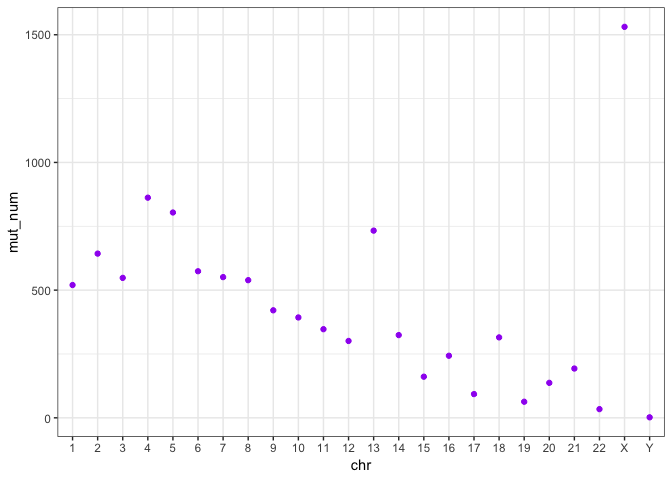
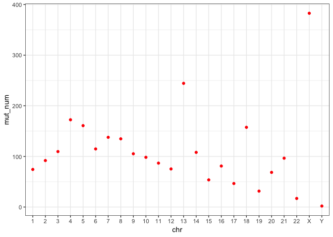
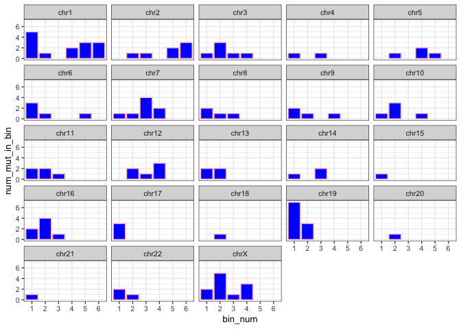

The report describes the work done for analysing and understanding TMB on one of the ensemble somatic variant calls (`/data/cephfs/punim0010/data/Results/Patients/CUP_SC932/final/umccrised/cup_tissue/somatic/ensemble-pon-pass.vcf.gz`). Many thanks to Peter for providing specific pointers and useful explanation on how to tackle various issues in R. The current script is an attempt to filter variants specifically in the coding region.

Required packages


```r
library(vcfR)
library(dplyr)
## Warning: package 'dplyr' was built under R version 3.5.1
library(ggplot2)
library(reticulate)
```

Reading in the the input file


```r
vcf <-  read.vcfR("~/Documents/UMCCR/data/ensemble-pon-pass.vcf") # 20,361 variants in total
## Scanning file to determine attributes.
## File attributes:
##   meta lines: 343
##   header_line: 344
##   variant count: 20361
##   column count: 11
## 
Meta line 343 read in.
## All meta lines processed.
## gt matrix initialized.
## Character matrix gt created.
##   Character matrix gt rows: 20361
##   Character matrix gt cols: 11
##   skip: 0
##   nrows: 20361
##   row_num: 0
## 
Processed variant 1000
Processed variant 2000
Processed variant 3000
Processed variant 4000
Processed variant 5000
Processed variant 6000
Processed variant 7000
Processed variant 8000
Processed variant 9000
Processed variant 10000
Processed variant 11000
Processed variant 12000
Processed variant 13000
Processed variant 14000
Processed variant 15000
Processed variant 16000
Processed variant 17000
Processed variant 18000
Processed variant 19000
Processed variant 20000
Processed variant: 20361
## All variants processed
#head(vcf)
```

Have a named vector with chr + chr_length.
You can extract the chr_length for chr, and then bin based on that.
In a named vector, you can access each element by name such as chr_lengths[chr_you_want].


```r
chr_lengths <- c(249250621L, 243199373L, 198022430L, 191154276L,
                 180915260L, 171115067L, 159138663L, 146364022L,
                 141213431L, 135534747L, 135006516L, 133851895L,
                 115169878L, 107349540L, 102531392L,  90354753L,
                 81195210L,  78077248L,   59128983L,  63025520L,
                 48129895L,  51304566L,  155270560L,  59373566L)
chr_names <- c(1:22, "X", "Y")
names(chr_lengths) <- chr_names
```

Declare bin size (in bases) - it can be variable


```r
bin_size <- 40000000
```


```r
chrom <- vcfR::getCHROM(vcf)
x <- table(chrom)
x
## chrom
##    1   10   11   12   13   14   15   16   17   18   19    2   20   21   22 
## 1142  828  875  712 1046  689  448  562  274  585  290 1434  284  368  130 
##    3    4    5    6    7    8    9    X    Y 
## 1155 1543 1502 1014 1130 1187  706 2455    2
# How can I sort not alphanumerically
# Use gtools::mixedorder to get the ordered indices (or mixedsort to sort them)
sorted_ind <- gtools::mixedorder(names(x))
sorted_ind
##  [1]  1 12 16 17 18 19 20 21 22  2  3  4  5  6  7  8  9 10 11 13 14 15 23
## [24] 24
x <- x[sorted_ind]
x
## chrom
##    1    2    3    4    5    6    7    8    9   10   11   12   13   14   15 
## 1142 1434 1155 1543 1502 1014 1130 1187  706  828  875  712 1046  689  448 
##   16   17   18   19   20   21   22    X    Y 
##  562  274  585  290  284  368  130 2455    2
chr_fac <- factor(names(x), levels = gtools::mixedsort(names(x)))
chr_fac
##  [1] 1  2  3  4  5  6  7  8  9  10 11 12 13 14 15 16 17 18 19 20 21 22 X 
## [24] Y 
## 24 Levels: 1 2 3 4 5 6 7 8 9 10 11 12 13 14 15 16 17 18 19 20 21 22 ... Y
```

Get chromosome and filter vcf for that chromosome


```r
# takes a vcf and a chromosome
# outputs df with pos + chr for that chromosome
filter_chr <- function(x, vcf) {
  vcf_chr_pos_ann <- data.frame(chr=getCHROM(vcf), pos=getPOS(vcf), ann=vcfR::extract.info(vcf, "ANN"), stringsAsFactors = FALSE)
  return(filter(vcf_chr_pos_ann, chr == x))
}
```

Prepare bins for the specific chromosome


```r
bin_chr <- function(chr_lengths, chr_name, bin_size) {
  return(seq(from = 0, to = chr_lengths[chr_name], by = bin_size))
}
```

Count mutations in a chromosome, using specific annotations. For now focussing on using the annotation "coding_sequence_variant", i.e. a sequence variant that changes coding sequence (http://sequenceontology.org/browser/current_svn/term/SO:0001580).


```r
count_mut_per_bin <- function(chr_pos_ann, bin_vec) {
  region_ann <- sapply(chr_pos_ann$ann, function(x){
     y <- strsplit(x, "\\|")[[1]][2]
     })
  region_ann <- unname(region_ann)
  dfs_list <- list()
  for (i in 1:length(region_ann)){
    if (region_ann[i] == "intergenic_region"){
        df <- data.frame(chr_pos_ann[i,2], findInterval(chr_pos_ann[i,2], bin_vec))
        dfs_list[[i]] <- df
    }
  }

#Bind rows together
combined <- bind_rows(dfs_list)
tab <- table(combined[, 2])
df <- data.frame(bin_num = names(tab),
                   num_mut_in_bin = c(unname(tab)),
                   stringsAsFactors = FALSE)
#df
}
```

Apply same function to all chromosomes. This gives a numerical vector containing the number of variants for each chromosome 


```r
results <- vector("numeric", length = length(chr_names))
results3 <- vector("numeric", length = length(chr_names))
for (i in 1:length(chr_names)) {
  results[i] <- mean(count_mut_per_bin(filter_chr(chr_names[i], vcf), bin_chr(chr_lengths, chr_names[i], bin_size))[, 2])
  results3[i] <- sum(count_mut_per_bin(filter_chr(chr_names[i], vcf), bin_chr(chr_lengths, chr_names[i], bin_size))[, 2])
}
print(results)
##  [1]  74.28571  91.85714 109.60000 172.40000 160.80000 114.80000 137.75000
##  [8] 134.75000 105.25000  98.25000  86.75000  75.25000 244.33333 108.00000
## [15]  53.66667  81.00000  46.50000 157.50000  31.50000  68.50000  96.50000
## [22]  17.00000 382.75000   2.00000
print(results3)
##  [1]  520  643  548  862  804  574  551  539  421  393  347  301  733  324
## [15]  161  243   93  315   63  137  193   34 1531    2
```


* Calculate number of mutations per bin for all chromosomes:


```r
results2 <- vector("list", length = length(chr_names))
for (i in 1:length(chr_names)) {
  results2[[i]] <- count_mut_per_bin(filter_chr(chr_names[i], vcf), bin_chr(chr_lengths, chr_names[i], bin_size))
}
```

* Turn a list that contains X data.frames to a single data.frame


```r
names(results2) <- paste("chr", chr_names, sep = "")
str(results2)
## List of 24
##  $ chr1 :'data.frame':	7 obs. of  2 variables:
##   ..$ bin_num       : chr [1:7] "1" "2" "3" "4" ...
##   ..$ num_mut_in_bin: int [1:7] 65 68 133 12 150 70 22
##  $ chr2 :'data.frame':	7 obs. of  2 variables:
##   ..$ bin_num       : chr [1:7] "1" "2" "3" "4" ...
##   ..$ num_mut_in_bin: int [1:7] 134 121 100 128 77 76 7
##  $ chr3 :'data.frame':	5 obs. of  2 variables:
##   ..$ bin_num       : chr [1:5] "1" "2" "3" "4" ...
##   ..$ num_mut_in_bin: int [1:5] 121 60 186 77 104
##  $ chr4 :'data.frame':	5 obs. of  2 variables:
##   ..$ bin_num       : chr [1:5] "1" "2" "3" "4" ...
##   ..$ num_mut_in_bin: int [1:5] 201 206 79 194 182
##  $ chr5 :'data.frame':	5 obs. of  2 variables:
##   ..$ bin_num       : chr [1:5] "1" "2" "3" "4" ...
##   ..$ num_mut_in_bin: int [1:5] 371 99 172 75 87
##  $ chr6 :'data.frame':	5 obs. of  2 variables:
##   ..$ bin_num       : chr [1:5] "1" "2" "3" "4" ...
##   ..$ num_mut_in_bin: int [1:5] 80 190 198 65 41
##  $ chr7 :'data.frame':	4 obs. of  2 variables:
##   ..$ bin_num       : chr [1:4] "1" "2" "3" "4"
##   ..$ num_mut_in_bin: int [1:4] 115 205 127 104
##  $ chr8 :'data.frame':	4 obs. of  2 variables:
##   ..$ bin_num       : chr [1:4] "1" "2" "3" "4"
##   ..$ num_mut_in_bin: int [1:4] 121 136 174 108
##  $ chr9 :'data.frame':	4 obs. of  2 variables:
##   ..$ bin_num       : chr [1:4] "1" "2" "3" "4"
##   ..$ num_mut_in_bin: int [1:4] 228 30 120 43
##  $ chr10:'data.frame':	4 obs. of  2 variables:
##   ..$ bin_num       : chr [1:4] "1" "2" "3" "4"
##   ..$ num_mut_in_bin: int [1:4] 129 83 151 30
##  $ chr11:'data.frame':	4 obs. of  2 variables:
##   ..$ bin_num       : chr [1:4] "1" "2" "3" "4"
##   ..$ num_mut_in_bin: int [1:4] 86 77 137 47
##  $ chr12:'data.frame':	4 obs. of  2 variables:
##   ..$ bin_num       : chr [1:4] "1" "2" "3" "4"
##   ..$ num_mut_in_bin: int [1:4] 81 91 92 37
##  $ chr13:'data.frame':	3 obs. of  2 variables:
##   ..$ bin_num       : chr [1:3] "1" "2" "3"
##   ..$ num_mut_in_bin: int [1:3] 44 432 257
##  $ chr14:'data.frame':	3 obs. of  2 variables:
##   ..$ bin_num       : chr [1:3] "1" "2" "3"
##   ..$ num_mut_in_bin: int [1:3] 74 142 108
##  $ chr15:'data.frame':	3 obs. of  2 variables:
##   ..$ bin_num       : chr [1:3] "1" "2" "3"
##   ..$ num_mut_in_bin: int [1:3] 33 35 93
##  $ chr16:'data.frame':	3 obs. of  2 variables:
##   ..$ bin_num       : chr [1:3] "1" "2" "3"
##   ..$ num_mut_in_bin: int [1:3] 53 174 16
##  $ chr17:'data.frame':	2 obs. of  2 variables:
##   ..$ bin_num       : chr [1:2] "1" "2"
##   ..$ num_mut_in_bin: int [1:2] 43 50
##  $ chr18:'data.frame':	2 obs. of  2 variables:
##   ..$ bin_num       : chr [1:2] "1" "2"
##   ..$ num_mut_in_bin: int [1:2] 124 191
##  $ chr19:'data.frame':	2 obs. of  2 variables:
##   ..$ bin_num       : chr [1:2] "1" "2"
##   ..$ num_mut_in_bin: int [1:2] 56 7
##  $ chr20:'data.frame':	2 obs. of  2 variables:
##   ..$ bin_num       : chr [1:2] "1" "2"
##   ..$ num_mut_in_bin: int [1:2] 61 76
##  $ chr21:'data.frame':	2 obs. of  2 variables:
##   ..$ bin_num       : chr [1:2] "1" "2"
##   ..$ num_mut_in_bin: int [1:2] 188 5
##  $ chr22:'data.frame':	2 obs. of  2 variables:
##   ..$ bin_num       : chr [1:2] "1" "2"
##   ..$ num_mut_in_bin: int [1:2] 15 19
##  $ chrX :'data.frame':	4 obs. of  2 variables:
##   ..$ bin_num       : chr [1:4] "1" "2" "3" "4"
##   ..$ num_mut_in_bin: int [1:4] 250 265 568 448
##  $ chrY :'data.frame':	1 obs. of  2 variables:
##   ..$ bin_num       : chr "1"
##   ..$ num_mut_in_bin: int 2
#binding1 <- do.call("rbind", results2) # this sucks
binding2 <- dplyr::bind_rows(results2, .id = "chromosome")
```

Plotting the total number of variants (filtered using specific annotations) across all chromosomes


```r
df <- data.frame(chr = chr_fac, mut_num = results3)
df
##    chr mut_num
## 1    1     520
## 2    2     643
## 3    3     548
## 4    4     862
## 5    5     804
## 6    6     574
## 7    7     551
## 8    8     539
## 9    9     421
## 10  10     393
## 11  11     347
## 12  12     301
## 13  13     733
## 14  14     324
## 15  15     161
## 16  16     243
## 17  17      93
## 18  18     315
## 19  19      63
## 20  20     137
## 21  21     193
## 22  22      34
## 23   X    1531
## 24   Y       2
ggplot(df, aes(x = chr, y = mut_num)) +
  geom_point(colour = "purple") +
  theme_bw()
```

<!-- -->

Plotting the mean of variants (filtered using specific annotations) across all bins in a chromosome i.e. results 


```r
df <- data.frame(chr = chr_fac, mut_num <- results)
ggplot(df, aes(x = chr, y = mut_num)) +
  geom_point(colour = "red") +
  theme_bw()
```

<!-- -->

Plotting and comparing mutations (filtered using specific annotations), across bins in all chromosomes


```r
df <- binding2 
df_new <- dplyr::mutate(df, chr_factor = factor(chromosome, levels = gtools::mixedsort(unique(chromosome))))
head(df)
##   chromosome bin_num num_mut_in_bin
## 1       chr1       1             65
## 2       chr1       2             68
## 3       chr1       3            133
## 4       chr1       4             12
## 5       chr1       5            150
## 6       chr1       6             70
bp <- ggplot(df_new, aes(x = bin_num, y = num_mut_in_bin)) +
  geom_bar(stat = "identity", fill="blue", colour = "pink") +
  facet_wrap(~chr_factor) +
  theme_bw(base_size = 10)
bp + guides(fill=FALSE)
```

<!-- -->

Calculating mutations per megabase


```r
fix <- getFIX(vcf)
vcf_number_rows <- nrow(fix)
mutations_megabase <- ceiling(vcf_number_rows/3200) 
```

The _total number of mutations_ in the vcf are **20361** and _number of mutations per megabase_ are **7**.

Calculating mutations in the coding regions/exons. 


```r
ann <- vcfR::extract.info(vcf, "ANN")
region_ann <- sapply(ann, function(x){
  y <- strsplit(x, "\\|")[[1]][2]
})
region_ann <- unname(region_ann)
table(region_ann)
## region_ann
##                                                          3_prime_UTR_variant 
##                                                                          104 
##                               5_prime_UTR_premature_start_codon_gain_variant 
##                                                                            8 
##                                                          5_prime_UTR_variant 
##                                                                           36 
##                                                conservative_inframe_deletion 
##                                                                            1 
##                                                      downstream_gene_variant 
##                                                                         1311 
##                                                           frameshift_variant 
##                                                                            9 
## frameshift_variant&splice_donor_variant&splice_region_variant&intron_variant 
##                                                                            1 
##                                                      initiator_codon_variant 
##                                                                            1 
##                                                            intergenic_region 
##                                                                        10332 
##                                                               intron_variant 
##                                                                         6642 
##                                                             missense_variant 
##                                                                          101 
##                                       missense_variant&splice_region_variant 
##                                                                            5 
##                                           non_coding_transcript_exon_variant 
##                                                                           53 
##                                       splice_acceptor_variant&intron_variant 
##                                                                            2 
##                                          splice_donor_variant&intron_variant 
##                                                                            4 
##                                                        splice_region_variant 
##                                                                            1 
##                                         splice_region_variant&intron_variant 
##                                                                           17 
##                                     splice_region_variant&synonymous_variant 
##                                                                            1 
##                                                                   start_lost 
##                                                                            1 
##                                                                  stop_gained 
##                                                                            4 
##                                                                    stop_lost 
##                                                                            1 
##                                                           synonymous_variant 
##                                                                           47 
##                                                        upstream_gene_variant 
##                                                                         1679
```

*TO DO*

Refer to trello card for specific pointers.
`https://trello.com/c/2TSThlBH/118-add-somatic-burden-to-reports`

Longer runtime - speicifcally for `count_mut_per_bin` and `mutations_per_bin` functions. Tried replacing matrix with dataframe but still not good enough - discuss with R-guru (Peter) about ways to improve it. One point is, these both blocks are refering to same function. So probably try merging these in one call.

