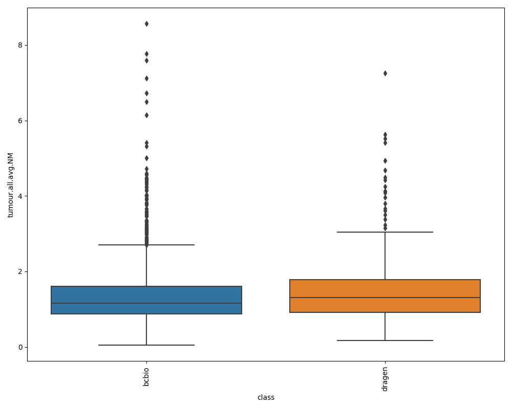
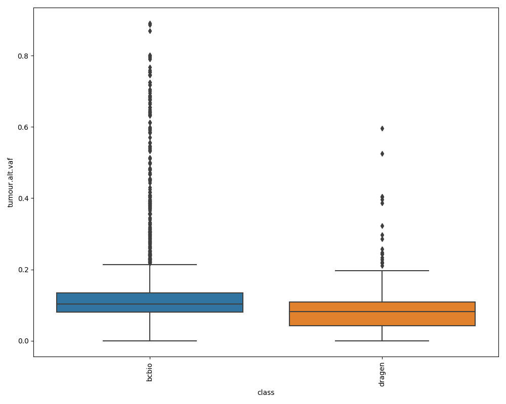
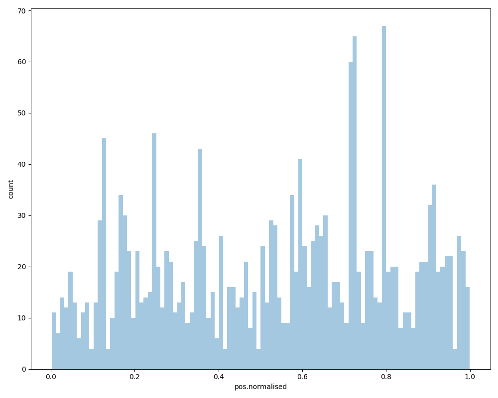
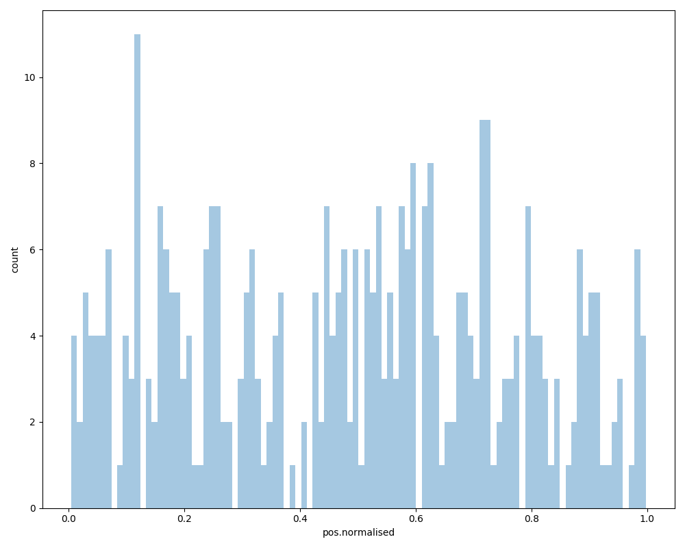
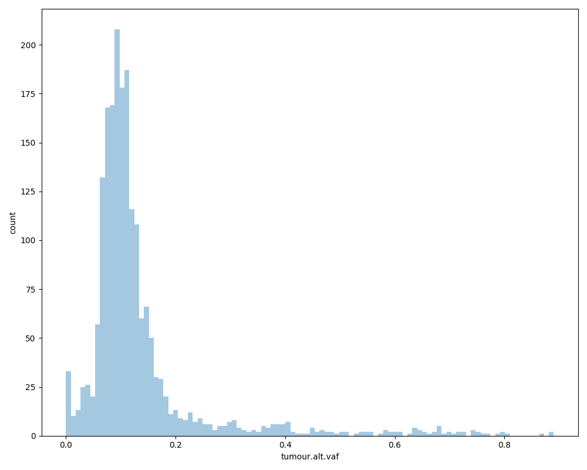
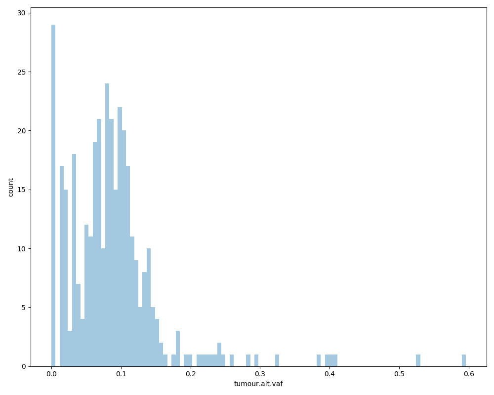
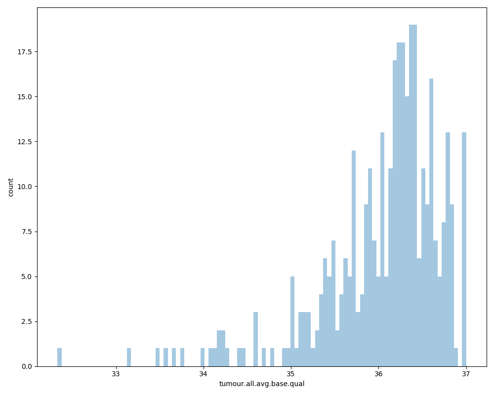
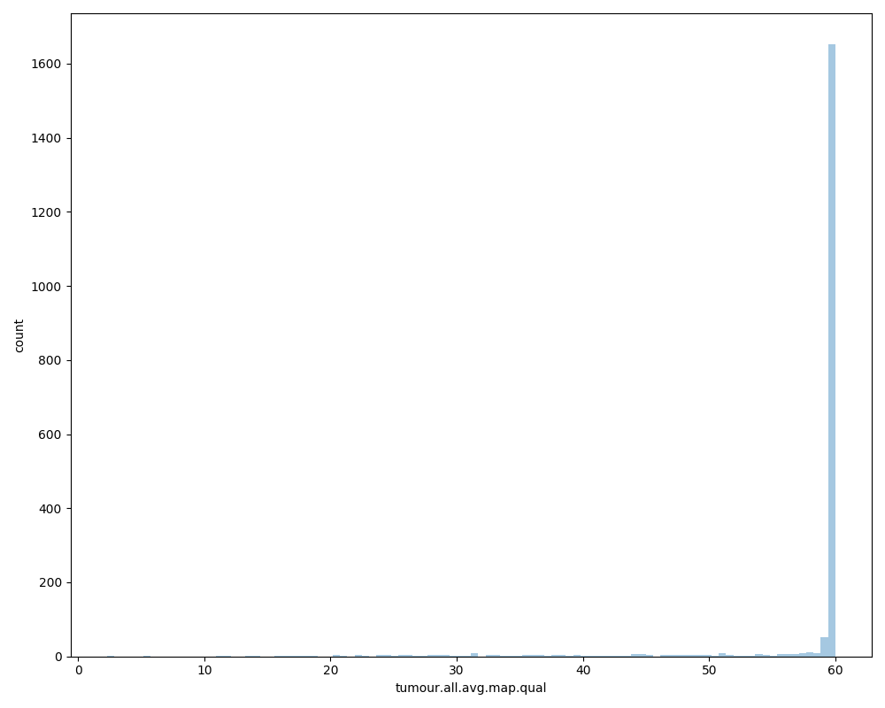

## Overview

The basic idea here is to compare bcbio and Dragen specific variants using [varlap](https://github.com/bjpop/varlap).

## Input Data

- Working with P025 data in `/g/data3/gx8/projects/Hofmann_Cromwell/2019-02-01T0241_Cromwell_WGS_2016.249.18.WH.P025/final`.

- And the vcfs being tested against are in `/g/data/gx8/projects/Hofmann_Cromwell/Dragen/P025/var_cmp/isec_filt_pass/`

```
0000.vcf for records private to bcbio,
0001.vcf for records private to dragen,
0002.vcf for shared records
```

## Processing

For varlap, to be able to include a Class column, for each variant, the input variants must be in CSV format.

Relatively straightforward to achieve using following steps - scripted [here](https://github.com/umccr/sk-explore/blob/master/varlap/analysis/vcf2csv.R). The script performs the following steps:

- drop all the VCF lines starting with #

- remove all unneeded columns

- add Class column

- add a new header row

- required columns are:

- chrom,pos,ref,alt

- CSV header names should be as above, lowercase

- any additional columns can be added in any case


### Processed data summary

Varlap considers the genomic locus of each variant in each of the supplied BAM files and records information about the corresponding alignment context at that locus. Varlap outputs a CSV file containing one row per input variant, with columns recording the various computed metrics about that variant.  


```
##  [1] "chrom"                               "pos"                                
##  [3] "ref"                                 "alt"                                
##  [5] "class"                               "vartype"                            
##  [7] "pos.normalised"                      "sample"                             
##  [9] "tumour.depth"                        "tumour.A"                           
## [11] "tumour.T"                            "tumour.G"                           
## [13] "tumour.C"                            "tumour.N"                           
## [15] "tumour.ref"                          "tumour.alt"                         
## [17] "tumour.alt.vaf"                      "tumour.ref.avg.NM"                  
## [19] "tumour.ref.avg.base.qual"            "tumour.ref.avg.map.qual"            
## [21] "tumour.ref.avg.align.len"            "tumour.ref.avg.clipped.bases"       
## [23] "tumour.ref.avg.indel.bases"          "tumour.ref.fwd.strand"              
## [25] "tumour.ref.rev.strand"               "tumour.ref.normalised.read.position"
## [27] "tumour.alt.avg.NM"                   "tumour.alt.avg.base.qual"           
## [29] "tumour.alt.avg.map.qual"             "tumour.alt.avg.align.len"           
## [31] "tumour.alt.avg.clipped.bases"        "tumour.alt.avg.indel.bases"         
## [33] "tumour.alt.fwd.strand"               "tumour.alt.rev.strand"              
## [35] "tumour.alt.normalised.read.position" "tumour.all.avg.NM"                  
## [37] "tumour.all.avg.base.qual"            "tumour.all.avg.map.qual"            
## [39] "tumour.all.avg.align.len"            "tumour.all.avg.clipped.bases"       
## [41] "tumour.all.avg.indel.bases"          "tumour.all.fwd.strand"              
## [43] "tumour.all.rev.strand"               "tumour.all.normalised.read.position"
```

**bcbio specific variants**


```
## [1] 2156    5
```

```
##   chrom      pos ref alt class
## 1  chr1   996818   T   C bcbio
## 2  chr1  6261434   A   C bcbio
## 3  chr1  6341023   A   G bcbio
## 4  chr1  9780607   T   A bcbio
## 5  chr1 11024099  CT   C bcbio
## 6  chr1 23559979   T   C bcbio
```

**dragen specific variants**


```
## [1] 406   5
```

```
##   chrom      pos ref alt  class
## 1  chr1  1660645   T   C dragen
## 2  chr1 16429303   T   G dragen
## 3  chr1 23309926 GAA   G dragen
## 4  chr1 23309959   A   G dragen
## 5  chr1 23971595   T   G dragen
## 6  chr1 35385507   A   G dragen
```

## Including Plots

### Distribution

The distribution of variants between both bcbio (left) and dragen (right) classes looks fairly similar



### Histograms

**pos.normalized**  bcbio (left) and dragen (right)

It is an output from varlap that tells a normalised chromosome position for a variant between [0,1]. Basically it takes the genomic position of the variant (on a given chromosome) and divides it by the length of the chromosome.



**tumour.alt.vaf**  bcbio (left) and dragen (right)

tumour.alt.vaf is the VAF of the ALT allele at this locus in the tumour sample. VAF is: num(ALT) / total_reads



**tumour.all.avg.base.qual**  bcbio (left) and dragen (right)

tumour.all.avg.base.qual is the average base quality at this locus for ALL reads overlapping this locus. By ALL reads it means it doesn't matter whether the read contains the REF or ALT allele (or anything else). It just counts ALL reads.



**tumour.all.avg.map.qual**  bcbio (left) and dragen (right)

tumour.all.avg.map.qual is the average mapping quality of reads that overlap the locus. By ALL reads it means it doesn't matter whether the read contains the REF or ALT allele (or anything else). It just counts ALL reads.



**tumour.alt.avg.base.qual**  bcbio (left) and dragen (right)

tumour.alt.avg.base.qual is the base quality of reads that overlap the locus, but only considering reads that support the ALT allele, in the tumour sample.


**tumour.alt.avg.map.qual**  bcbio (left) and dragen (right)

tumour.alt.avg.map.qual is the average mapping quality of reads that overlap the locus, but only considering reads that support the ALT allele, in the tumour sample.


### Scatter

As currenly, I have run varlap with tumor only mode, so compared the following variables:

**tumour.ref.avg.NM and tumour.alt.avg.NM** 

This is the average edit distance of reads overlapping the locus for reads supporting the ref/alt allele in the tumour sample


## Interesting follow-up pointers

- Generate the output for variants at AF < 0.15 that are either unique to bcbio or to Dragen.
- Check the differance between variants called just by bcbio vs those that are shared (globally or at low AF).

